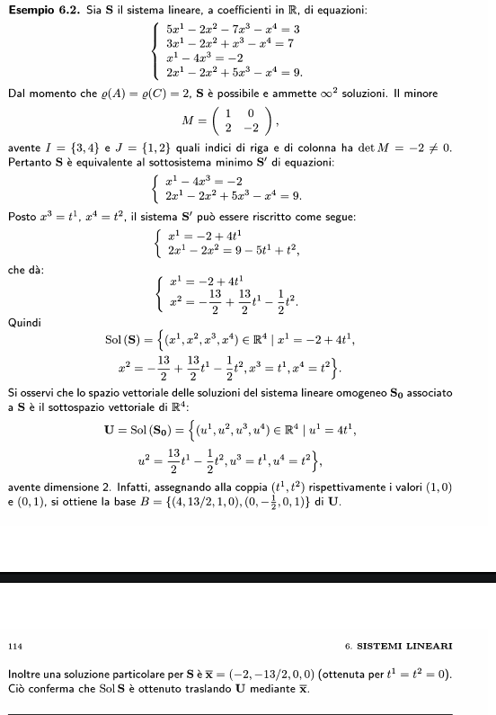
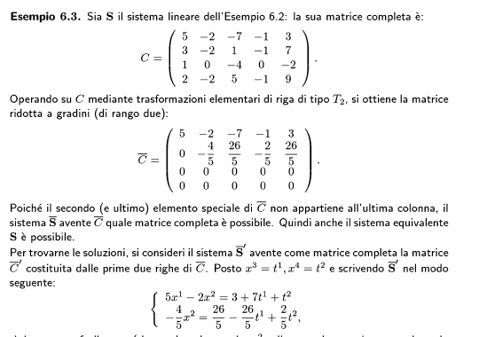

## Opzione 1: sistema normale
Per controllare che un sistema sia normale come prima cosa la Matrice incompleta A deve essere quadrata
In secondo luogo controlliamo il suo determinante, e se è diverso da 0 il sistema è determinato (1 soluzione)
A questo punto mi basta applicare la [[12. Sistemi Lineari#Formula di Leibniz-Cramer]] per risolvere il sistema rispetto a tutte le incognite
## Opzione 2: sistema rettangolare
### Algoritmo A
Mettiamo di avere un sistema la cui matrice contiene delle linee combinazione lineare di altre.
Troviamo quindi il [[12. Sistemi Lineari#Sistemi lineari equivalenti]] minimo che avrà le stesse soluzioni e che sarà ridotto in maniera da formare una matrice linearmente indipendente
ATTENZIONE: per controllare questa cosa, calcoliamo il rango di A. Questo passaggio quindi dipende da quali colonne e quali righe abbiamo usato per effettuare il calcolo del rango
Riduciamo quindi il sistema al suo equivalente minimo
Spostiamo a destra le incognite non incluse (quindi portiamo tutte quelle che non erano incluse nel minore orlato di ordine maggiore che abbiamo calcolato prima) 
A questo punto applicheremo la formula di Leibniz-Cramer per risolvere rispetto a quelle incognite a sinistra
Infine la soluzione potrà essere riscritta come chiusura lineare dei risultati trovati
#### ESEMPIO
1. Lo puoi trovare qui sotto "metodo di cramer per sistemi rettangolari"
https://www.youmath.it/lezioni/algebra-lineare/matrici-e-vettori/3848-metodi-risoluzione-sistemi-lineari.html
2. 
#### TIPS
prova a riguardare anche dal libro se dai miei appunti non sembra chiaro

### Algoritmo B
Non l'ha approfondito, la matrice va ridotta a gradini
Non è esattamente chiaro, quindi guardo l'esempio

Dopodiché procedi come per l'algoritmo A