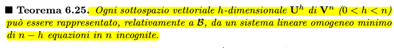
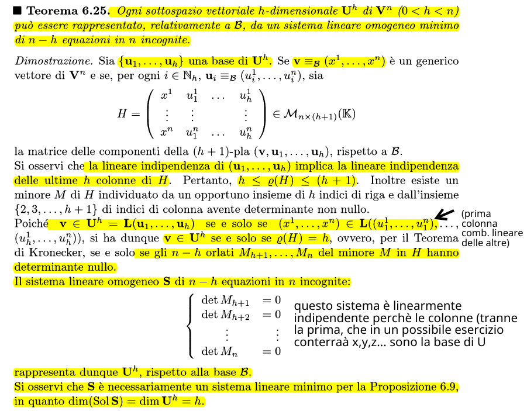
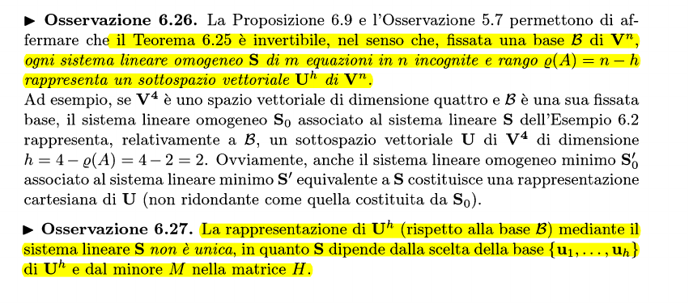

La rappresentazione cartesiana di un sottospazio vettoriale $U^h$ di $V^n$ può essere vista come un sistema lineare omogeneo di _m_ equazioni e _n_ incognite.
**L'insieme delle componenti dei vettori di $U^h$ rispetto a B**, dove B è una base di U, **coincide con Sol(S)**. Si può dire quindi che il rango di A (matrice incompleta) è uguale a m-n

### Teorema della rappresentazione attraverso sistema omogeneo minimo

#### Dimostrazione

### Osservazioni
