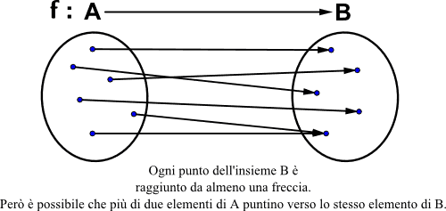
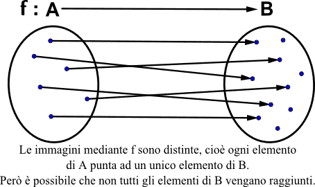
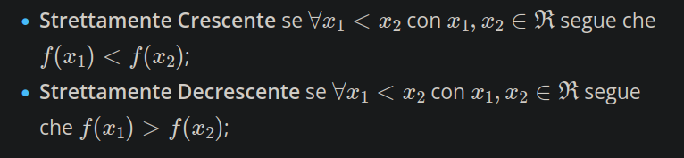

### Proprietà che possono avere
#### Suriettiva

#### Iniettiva

### Biettiva (o biunivoca)

#### Monotonia
DA CONSIDERARE IN UN INTERVALLO!

### Funzioni Elementari
#### Retta (o lineare)
y = mx+q
- invertibile
#### Valore assoluto
#### proprietà (valgono per $x \in R$)
- $|x|>0$
- $|x| = 0 \iff x=0$
- $|-x| = |x|$
- $|x_1*x_2| = |x_1|*|x_2|$
- $|x_1/x_2| = |x_1|/|x_2|$
- $|x|< o < r \iff -r < x < r$ (vale anche con $\le$)
importante: [[Teoremi introduttivi sui reali#Disuguaglianza triangolare]]
#### Potenza, esponenziale, logaritmo

**ESPONENZIALE**
$f(x) = a^x$
- strett. crescente $a > 1$
- strett. descrescente $0<a<1$

**POTENZA**
$f(x) = x^n, n \in Z$
- strettamente crescente se n >= 0

**LOGARITMO**
$y= \log_{a}x \iff a^y=x$ (RICORDA: quale esponente devo mettere alla base per avere x?)
$f$ inversa dell'esponenziale
#### Trigonometriche
- sin(x)
- cos(x)
- tan(x)
periodiche