## Definizione di determinante

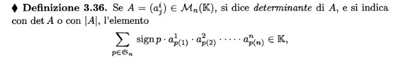
Sommatoria di tutte le permutazioni di A, in modo che in ciascuna di essi risulti un solo elemento per riga e per colonna

### Sottomatrice
Data una matrice A $\in M_{mxn}(\mathbb K)$, si dice sottomatrice di tipo h x k (con h $\le$ m e k $\le$ n) estratta da A ogni matrice avente per elementi gli elementi di A appartenenti contemporaneamente a h righe fissate e a k colonne fissate.

### Minore complementare
Si dice minore complementare dell'elemento $a^i_j$ la matrice $M^i_j$ di ordine n -1 ottenuta da A cancellandone la i-esima riga e la j-esima colonna.

### Complemento Algebrico
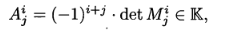
dove $M^i_j$ è il minore complementare dell'elemento della riga i e colonna j
## Calcolo del determinante
### Ordine 2
Effettuare la sottrazione tra la diagonale principale e la diagonale secondaria
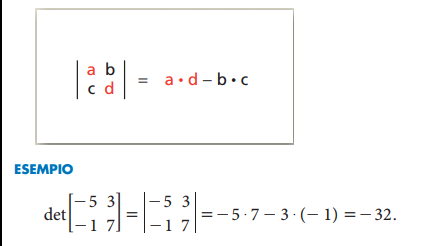

### Ordine 3
**Regola di Sarrus**
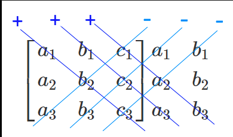

### Ordine 4+
Utilizzo il [[#Teorema di Laplace]]

## Proprietà del determinante
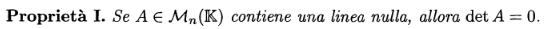
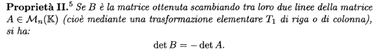
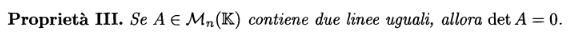
Multi linearità (IV' e IV''):
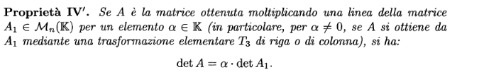
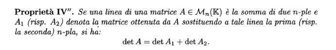
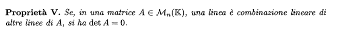

## Teorema di Laplace
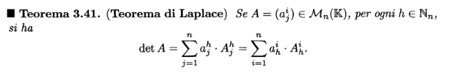
### Dimostrazione
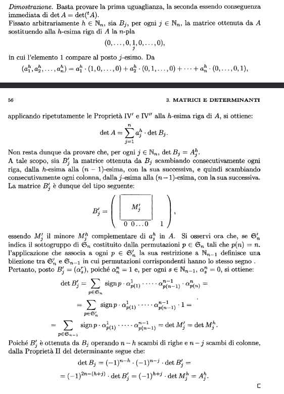

## Teorema di Binet
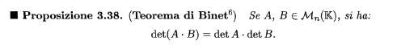
## Teorema matrici inverse
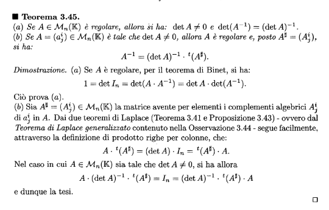
