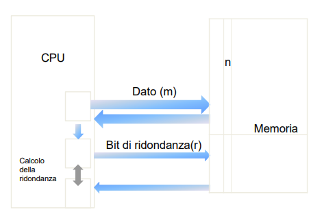

## Reti di controllo
Si usano r bit di ridondanza (totale quindi è bit + r)

Ci sono reti per rilevazione e correzione di errori.

Sia 𝐶 = {𝑐𝑖 ,𝑖 = 1,…,2 𝑛} l’insieme delle parole di codice.
sia 𝐶𝐿 = {𝑐𝑘,𝑘 = 1,…,2 𝑚} l’insieme delle parole legali. 

Se si verifica una parola 𝑐̃∈ (𝐶 − 𝐶𝐿), allora 𝑐̃non è legale e si capisce che si è verificato un errore.

### Schema di controllo

## Hamming
### Distanza
la Distanza di Hamming tra due variabili binarie a e a’di n bit vale d (numero intero tra 0 e n) se d è il **numero di cifre binarie diverse tra le due variabili**.
Si calcola tramite la rete logica combinatoria **XOR**.

### Correzione

#### 1. Metodo Tabellare (o Basato sulle Posizioni)

Questo metodo è più intuitivo per la generazione e la verifica manuale dei bit di parità (P).

##### Logica e Codifica

* **Posizioni P:** I bit di parità ($\text{P}_1, \text{P}_2, \text{P}_4, \ldots$) sono posti in posizioni che sono potenze di due ($1, 2, 4, \ldots$).
* **Controlli:** Ogni $\text{P}_i$ controlla l'insieme dei bit (dati e parità) le cui posizioni binarie contengono un '1' nella stessa posizione del bit di parità. Il calcolo si effettua tramite **XOR** (OR esclusivo).
    * Esempio: $\text{P}_1$ (posizione 1) controlla i bit con l'LSB (bit meno significativo) uguale a 1 (posizioni 3, 5, 7, 9, ...).

##### Decodifica e Correzione

1.  Si ricalcolano i bit di parità sulla parola ricevuta per ottenere i **bit di sindrome** ($\text{S}_i$).
2.  La sindrome $\text{S}$ (concatenazione di $\text{S}_i$, ad esempio $\text{S}_4 \text{S}_2 \text{S}_1$) è il valore binario che indica direttamente la **posizione dell'errore**.
3.  Se $\text{S} = 000$, la parola è corretta. Se $\text{S} \neq 000$, si inverte il bit in quella posizione per correggere l'errore.

---

#### 2. Metodo Matriciale (o Basato sulla Matrice di Parità H)

Questo metodo è formale e sfrutta le proprietà dell'algebra lineare.

##### Matrici Chiave

* **Matrice Generatrice ($\text{G}$):** Utilizzata per la codifica.
* **Matrice di Controllo di Parità ($\text{H}$):** Le colonne di $\text{H}$ sono tutte le rappresentazioni binarie delle posizioni dei bit da 1 a $\text{n}$.

##### Codifica

* La parola codificata $\mathbf{c}$ si ottiene moltiplicando il vettore dei dati $\mathbf{d}$ per la matrice generatrice $\text{G}$ (modulo 2):
    $$\mathbf{c} = \mathbf{d} \cdot \text{G} \quad \pmod{2}$$

##### Decodifica e Correzione

1.  Il **vettore di sindrome $\mathbf{s}$** si calcola moltiplicando il vettore della parola ricevuta $\mathbf{r}$ per la trasposta della matrice $\text{H}$:
    $$\mathbf{s} = \mathbf{r} \cdot \text{H}^\text{T} \quad \pmod{2}$$
2.  Se $\mathbf{s}$ è un vettore di zeri, la parola è corretta.
3.  Se $\mathbf{s}$ non è zero, $\mathbf{s}$ corrisponde esattamente a una delle **colonne** della matrice $\text{H}$. L'indice di quella colonna indica la **posizione dell'errore**.

### Rilevazione / Correzione
Se si vogliono rilevare k errori singoli è necessaria una parola con distanza d=k+1, perche’ con un codice di distanza k+1 non esiste modo che k errori singoli trasformino una parola valida in una altra parola valida. 

Se si vogliono correggere k errori singoli è necessaria una parola con distanza d=2k+1, perche’ in questo modo pur cambiando k bit la parola in codice (m+r) sarà comunque più vicina alla parola originaria che a tutte le altre e quindi si può risalire alla parola originaria.

## Codice di parità
Il codice più semplice è il bit di parità (pari) che aggiunge 1 bit per fare in modo che il numero degli 1 nella parola sia un numero pari. 
Ha una distanza d=2 e quindi rileva solo 1 solo errore.
E' un codice di rilevazione in quanto non sa dove è avvenuto l'errore.

*Rileva numero dispari di errori*: se fossero pari la parità tornerebbe al valore originale e i bit sarebbero trattati come valori corretti.

Generalmente il bit di parità è inserito ogni 8 bit (byte).
E' molto usato in quanto veloce e di semplice implementazione