# Concetti introduttivi
Tipi di architetture:
- embedded  🡒 wearable, sensors...
- domain specific
- general purpose (PC)
- high performance  🡒 leonardo, supercomputers

## DEFINIZIONE
I Calcolatori Elettronici o computer si possono definire *sistemi digitali di elaborazione dell’informazione, programmabili e general purpose.*

un calcolatore è un *sistema digitale di elaborazione capace di interpretare ed eseguire programmi (sequenze di istruzioni) memorizzati, elaborare dati digitali in ingresso e fornire dati in uscita.*
## SISTEMI
Nell'ambito scientifico, è un qualsiasi oggetto di studio che, pur essendo costituito da diversi elementi reciprocamente interconnessi e interagenti tra loro o con l’ambiente esterno, reagisce o evolve come un ELEMENTO UNITARIO, con proprie leggi generali.

La sua Organizzazione e Struttura vengono definite come la sua **architettura**.

La sua descrizione può essere:
- **FUNZIONALE** (comportamentale)
	descrive il suo funzionamento in termini di input e output
	Descrizione di un sistema digitale:
		- Gestione delle istruzioni
		- Elaborazione dati
		- Memorizzazione dei dati
		- Trasferimento dei dati
- **STRUTTURALE** (architetturale)
	descrive in base ai suoi elementi primitivi e come sono organizzati
		- CPU (ALU, registri, ...)
		- Memoria
		- I/O
- **FISICA** (implementazione)
	descrizione dettagliata dei componenti impiegati e come sono connessi

L'**analisi** consiste nello studio del sistema partendo dalla struttura fino a una ricostruzione funzionale (reverse engineering). E' univoca.

La **sintesi** è il contrario, partendo da quelle che sono le funzioni cercate si effettua la progettazione architetturale e poi l'implementazione. NON è univoca.

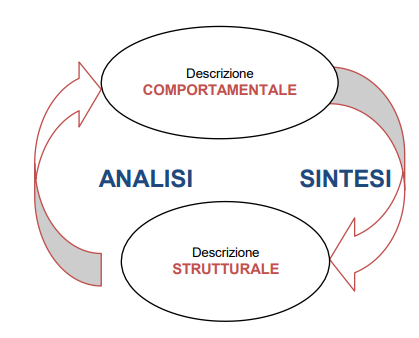

## DEFINIZIONE DI ARCHITETTURA DEI CALCOLATORI
L’architettura dei calcolatori è *il modello che data la descrizione funzionale ad uno specifico livello di astrazione, ne definisce la struttura e la organizzazione delle parti.*

L’architettura del calcolatore definisce genericamente l’hardware, i suoi componenti, la struttura e le funzionalità’ definire dalle istruzioni di linguaggio macchina (ISA) con cui si creano i programmi.

Le funzioni che si possono ottenere con una sintesi hardware sono le stesse ottenibili in software e viceversa, con un diverso rapporto tra prestazioni e flessibilità.
# Entropia
Informazione: 
Entropia: 
dove B è la base (numero degli elementi)
# Prestazioni
Tcpu= Ncc\*Tck == Tcpu = Ncc / f (Ncc = Number of clock cycles)
Tcpu = Ni\*CPI\*Tck (CPI dipende dall'ISA)
CPI = Ncc/NI (clock per instruction, NI = number of Instructions)
MIPS = fck / CPImedio

## Legge di Hamdal


# Algebra Booleana

### Operazioni di base
| Operazione | Simbolo | Descrizione |
|-------------|----------|-------------|
| **AND**     | ·        | `X · Y = 1` solo se entrambi X e Y sono 1 |
| **OR**      | +        | `X + Y = 1` se almeno uno tra X e Y è 1 |
| **NOT**     | ′        | `X′ = 1` se X = 0, e viceversa |

---

### Tavola delle leggi fondamentali

| Categoria            | Codice | Espressione     | Categoria (continua) | Codice | Espressione                                         |
| -------------------- | ------ | --------------- | -------------------- | ------ | --------------------------------------------------- |
| **Identità**         | (T1)   | `X + 0 = X`     | **Associativa**      | (T7)   | `(X + Y) + Z = X + (Y + Z) = X + Y + Z`             |
|                      | (T1′)  | `X · 1 = X`     |                      | (T7′)  | `(X · Y) · Z = X · (Y · Z) = X · Y · Z`             |
| **Elementi nulli**   | (T2)   | `X + 1 = 1`     | **Assorbimento**     | (T8)   | `X + X · Y = X`                                     |
|                      | (T2′)  | `X · 0 = 0`     |                      | (T8′)  | `X · (X + Y) = X`                                   |
| **Idempotenza**      | (T3)   | `X + X = X`     | **Distribuzione**    | (T9)   | `X · Y + X · Z = X · (Y + Z)`                       |
|                      | (T3′)  | `X · X = X`     |                      | (T9′)  | `(X + Y) · (X + Z) = X + Y · Z`                     |
| **Involuzione**      | (T4)   | `(X′)′ = X`     | **Combinazione**     | (T10)  | `(X + Y) · (X′ + Y) = Y`                            |
| **Complementarietà** | (T5)   | `X + X′ = 1`    |                      | (T10′) | `X · Y + X′ · Y = Y`                                |
|                      | (T5′)  | `X · X′ = 0`    | **Consenso**         | (T11)  | `(X + Y) · (X′ + Z) · (Y + Z) = (X + Y) · (X′ + Z)` |
| **Commutativa**      | (T6)   | `X + Y = Y + X` |                      | (T11′) | `X · Y + X′ · Z + Y · Z = X · Y + X′ · Z`           |
|                      | (T6′)  | `X · Y = Y · X` | **De Morgan**        | (T12)  | `(X + Y)′ = X′ · Y′`                                |
|                      |        |                 |                      | (T12′) | `(X · Y)′ = X′ + Y′`                                |

---

### Principio di Dualità
Ogni espressione booleana resta valida se si scambiano:
- `+` ↔ `·`
- `0` ↔ `1`

**Esempio:**  
Il duale di `X + 0 = X` è `X · 1 = X`.

## Mappe di karnaough e tabelle di verità
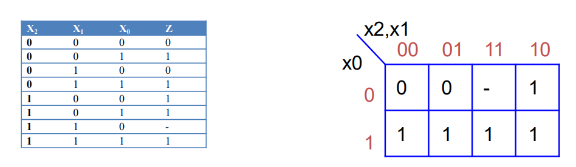
si usa il Grey (voglio un solo cambiamento di bit in colonne adiacenti)
### Implicanti

Un **implicante** è un prodotto logico (termine AND) di una o più variabili che rende la funzione 1 per **almeno** una combinazione degli ingressi.

- **Implicante semplice:** qualsiasi termine che implica la funzione.  
- **Implicante primo:** implicante non contenuto in un altro più generale.  
- **Implicante essenziale:** implicante primo che copre almeno un mintermine non coperto da altri implicanti.

**Esempio (Karnaugh 3 variabili):**
Se `F = Σm(1,3,5,7)`:
- Implicanti primi: `Z`
- Implicante essenziale: `Z`

---
#### Mintermini
Un **mintermine** è un prodotto (AND) di tutte le variabili del sistema, ognuna presa una sola volta in forma diretta o negata.  
Rappresenta una **combinazione unica** in cui la funzione vale 1.

Esempio per due variabili X, Y:

| Mintermine | Espressione | Valore (X,Y) | F(X,Y) |
| ---------- | ----------- | ------------ | ------ |
| m₀         | `X′ · Y′`   | 00           | 1      |
| m₁         | `X′ · Y`    | 01           | 1      |
| m₂         | `X · Y′`    | 10           | 1      |
| m₃         | `X · Y`     | 11           | 1      |


**Forma canonica somma di prodotti (SOP):**  
`F(X,Y) = Σm(1,2,3)` significa che F è 1 per i mintermini 1, 2 e 3.

---

#### Maxtermini
Un **maxtermine** è una somma (OR) di tutte le variabili, ognuna presa una sola volta in forma diretta o negata.  
Rappresenta una **combinazione unica** in cui la funzione vale 0.

Esempio per due variabili X, Y:

| Maxtermine | Espressione | Valore (X,Y) | F(X,Y) |
|-------------|--------------|---------------|---------|
| M₀ | `X + Y` | 00 | 0 |
| M₁ | `X + Y′` | 01 | 0 |
| M₂ | `X′ + Y` | 10 | 0 |
| M₃ | `X′ + Y′` | 11 | 0 |

**Forma canonica prodotto di somme (POS):**  
`F(X,Y) = ΠM(0,2)` significa che F è 0 per i maxtermini 0 e 2.

#### **Riepilogo:**
| Concetto | Operazione logica | Valore associato | Forma canonica |
|-----------|-------------------|------------------|----------------|
| Mintermine | AND (·) | F = 1 | Somma di prodotti (SOP) |
| Maxtermine | OR (+) | F = 0 | Prodotto di somme (POS) |
| Implicante | AND (·) | F = 1 per uno o più casi | Base per la semplificazione |

### Sintesi in Forma SP (Somma di Prodotti) e PS (Prodotto di Somme)

La **forma SP** (o **SOP**, *Sum of Products*) rappresenta la funzione come somma (OR) di termini prodotti (AND).

1. Costruire la **tabella della verità**.  
2. Selezionare le combinazioni per cui `F = 1`.  
3. Scrivere un **mintermine** per ciascuna di esse.  
4. Sommare (OR) tutti i mintermini.

**Esempio:**  
| X | Y | Z | F |
|---|---|---|---|
| 0 | 0 | 1 | 1 |
| 0 | 1 | 1 | 1 |
| 1 | 0 | 1 | 1 |

Mintermini:  
- `m1 = X′·Y′·Z`  
- `m3 = X′·Y·Z`  
- `m5 = X·Y′·Z`

**Risultato:**  
`F(X,Y,Z) = X′·Y′·Z + X′·Y·Z + X·Y′·Z = Σm(1,3,5)`

---

La **forma PS** (o **POS**, *Product of Sums*) rappresenta la funzione come prodotto (AND) di termini somma (OR).

1. Costruire la **tabella della verità**.  
2. Selezionare le combinazioni per cui `F = 0`.  
3. Scrivere un **maxtermine** per ciascuna di esse.  
4. Moltiplicare (AND) tutti i maxtermini.

**Esempio:**  
Dalla tabella precedente, `F = 0` per i casi 0, 2, 4, 6, 7 →  
Maxtermini:  
- `M0 = (X + Y + Z′)`  
- `M2 = (X + Y′ + Z′)`  
- `M4 = (X′ + Y + Z′)`  
- `M6 = (X′ + Y′ + Z′)`  
- `M7 = (X′ + Y′ + Z)`

**Risultato:**  
`F(X,Y,Z) = (X + Y + Z′)(X + Y′ + Z′)(X′ + Y + Z′)(X′ + Y′ + Z′)(X′ + Y′ + Z) = ΠM(0,2,4,6,7)`

---
#### Confronto tra SP e PS
| Aspetto | Forma SP (Somma di Prodotti) | Forma PS (Prodotto di Somme) |
|----------|-------------------------------|-------------------------------|
| Basata su | Mintermini | Maxtermini |
| `F = 1` per | Combinazioni specifiche | Tutte le altre combinazioni |
| Operatore esterno | OR (+) | AND (·) |
| Operatore interno | AND (·) | OR (+) |
| Forma canonica | `Σm(i)` | `ΠM(i)` |
| Derivazione | Diretta dai valori 1 della funzione | Diretta dai valori 0 della funzione |

## Amplificatori 3-state

Un **amplificatore a tre stati** (tri-state buffer) può assumere tre condizioni di uscita:  
1. **Alta (1)**  
2. **Bassa (0)**  
3. **Alta impedenza (Z)** → uscita disconnessa dal circuito.

Controllato da un segnale di **enable (EN)**:
- Se `EN = 1`, l’uscita segue l’ingresso (`Y = A`).
- Se `EN = 0`, l’uscita è in alta impedenza (`Y = Z`).

Usato per condividere linee dati comuni (bus) evitando conflitti tra più sorgenti.


## Multiplexer e decoder

Un **multiplexer** seleziona uno tra più ingressi e lo invia in uscita.  
Funziona come un **commutatore controllato** da segnali di selezione.

- **Ingressi dati:** 2ⁿ  
- **Ingressi di selezione:** n  
- **Uscita:** 1  
- **Funzione logica:**  
  `Y = Σ(Dᵢ · Sᵢ)` dove `Sᵢ` è la combinazione dei bit di selezione che attiva `Dᵢ`.

**Esempio:**  
MUX 4→1 con selettori S₁, S₀  
`Y = D₀·S₁′·S₀′ + D₁·S₁′·S₀ + D₂·S₁·S₀′ + D₃·S₁·S₀`

**Uso:**  
- Implementazione di funzioni logiche arbitrarie.  
- Selezione di canali o dati.

---

Un **decoder** effettua l’operazione inversa del MUX:  
trasforma una combinazione binaria di ingresso in un’unica uscita attiva.

- **Ingressi:** n  
- **Uscite:** 2ⁿ  
- **Funzione:** per ogni combinazione d’ingresso, **una sola uscita = 1**.

**Esempio:**  
Decoder 2→4:  

| Ingressi (A₁A₀) | Uscite |
|------------------|---------|
| 00 | Y₀ = 1 |
| 01 | Y₁ = 1 |
| 10 | Y₂ = 1 |
| 11 | Y₃ = 1 |

**Uso:**  
- Selezione di dispositivi o indirizzi.  
- Generazione di mintermini (base per tabelle di verità e circuiti logici).

# ALU (composizione)

AND
OR
ADD
SUB
CMP
NOR

### Half adder
* **Input:** 2 bit (chiamiamoli A e B). 
- **Output:** 2 bit:
	- **Sum (S):** Il risultato della somma (A XOR B). 
	- **Carry-out (Cout):** Il riporto generato dalla somma (A AND B).

**Limite:** **Non può accettare un riporto in ingresso (Carry-in)**. Per questo motivo, è "mezzo" sommatore e può essere usato solo per sommare i due bit meno significativi (LSB) di due numeri.


### Full adder
Il Full-Adder è un circuito più completo che esegue la somma di **tre singoli bit** binari. * **Input:** 3 bit: 
- Due bit da sommare (A e B).
- Un bit di **Carry-in (Cin):** Il riporto proveniente dalla somma della colonna precedente.

**Output:** 2 bit:
- **Sum (S):** Il risultato della somma dei tre bit (A XOR B XOR Cin).
- **Carry-out (Cout):** Il riporto generato per la colonna successiva.

**Vantaggio:** Gestendo il riporto in ingresso, i Full-Adder possono essere collegati in cascata per sommare numeri composti da più bit. (Un Full-Adder può essere costruito usando due Half-Adder e una porta OR).

Il problema dei full adder in cascata è il **ritardo**. Diventa notevole al crescere di n (numero bit).
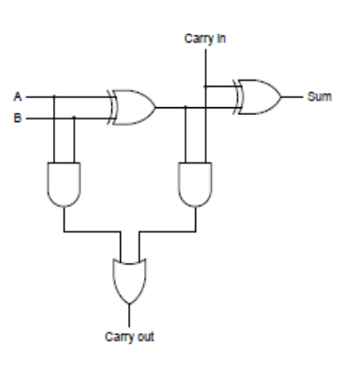

# Reti Sequenziali

**asincrone** se le variazioni delle configurazioni di ingresso vengono sentite e modificano lo stato e le uscite in ogni istante
**sincrone** se le variazioni delle configurazioni di ingresso vengono sentite e modificano lo stato e le uscite solo in presenza di un opportuno evento di sincronizzazione.

L’evento di sincronizzazione è normalmente associato ad un segnale attivo (il **clock**) o al cambiamento dello stato del segnale di sincronizzazione (fronte del clock)

Si chiama **tempo di propagazione** il tempo impiegato dal gate a propagare in uscita il cambiamento del segnale di ingresso.

Si dice **glitch** un impulso indesiderato dell’uscita in fase transitoria. Se una rete combinatoria può potenzialmente presentare un glitch allora si dice che è caratterizzata da un’**ALEA** (hazard). 
L’ALEA è una caratteristica (difetto) di una rete combinatoria tale per cui le uscite in transitorio possono avere un valore diverso da quello che possiedono a regime.
_Statiche_: output sbagliato
_Dinamiche_: cambiamento di più stati durante il transitorio

**Metastabilità**: ’effetto per cui l’uscita rimane indefinitivamente in uno stato instabile tra 0 ed 1. Si risolve allungando il clock o sincronizzando con reti sequenziali in cascata.

## Elementi di memoria

### 1. Set e Reset
Due ingressi logici che **forzano** lo stato di un elemento di memoria:
- **Set (S = 1)** → imposta l’uscita `Q = 1`
- **Reset (R = 1)** → imposta `Q = 0`
- Se `S = R = 1` → stato non valido (nelle versioni base)

---

### 2. Latch SR
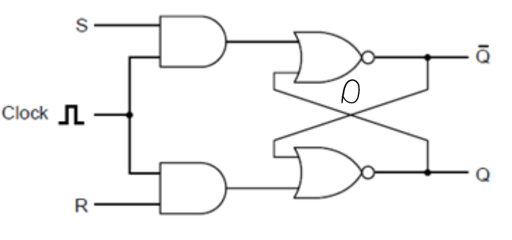
Dispositivo **bistabile** controllato da ingressi **S** e **R**.  
Memorizza lo stato finché non cambia un ingresso.

| S | R | Q(next) |
|---|---|----------|
| 0 | 0 | Q(prev) |
| 0 | 1 | 0 |
| 1 | 0 | 1 |
| 1 | 1 | non valido |

---

### 3. Latch D
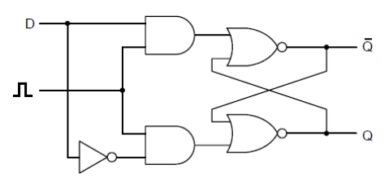
Versione semplificata del latch SR.  
Un solo ingresso **D (Data)**:
- `Q = D` quando **Enable = 1**
- Mantiene il valore quando **Enable = 0**

**Evita** lo stato non valido del latch SR.

---

### 4. Flip-Flop

Elemento **sincrono**: cambia stato solo sul **fronte di clock** (↑ o ↓).  
Esempi principali:
- **D Flip-Flop:** `Q(next) = D` al fronte di clock.  
- **JK Flip-Flop:**  
  - `J = 1, K = 0 → Q = 1`  
  - `J = 0, K = 1 → Q = 0`  
  - `J = K = 1 → Q` si inverte (toggle).  

Usato come base per registri e contatori.

### Registri come Porte Logiche

Un **registro** è un insieme di **flip-flop** collegati in parallelo, ciascuno memorizza un bit.  
Funziona come una **memoria temporanea** per parole binarie. Nei **register file** dei microprocessori, più registri sono organizzati insieme per permettere letture e scritture simultanee.

Ogni flip-flop agisce come una **porta logica di memorizzazione**:
- Gli ingressi di controllo (load, clock, reset) determinano quando i dati vengono caricati o azzerati.  
- Le uscite mantengono il valore finché non arriva un nuovo segnale di clock o reset.  

Nei register file, i **multiplexer** selezionano quale registro leggere, instradando l’uscita del registro desiderato verso il bus dati, mentre i **decoder** possono dirigere i dati di scrittura verso il registro corretto.

I registri possono essere:
- **Paralleli:** caricano tutti i bit contemporaneamente.  
- **Seriali:** caricano o scaricano i bit uno alla volta.  

Usati per memorizzare dati, indirizzi o risultati intermedi nei circuiti logici.

## Macchine a stati finiti

Un **automa a stati finiti** è una macchina a stati con un **numero finito di stati**, definita da:
- Un insieme di stati
- Uno stato iniziale
- Input e output
- Funzioni di transizione tra stati

### Modello di Moore

- L’**output dipende solo dallo stato corrente**.  
- Ogni stato ha associato un output fisso.  
- Vantaggio: output stabile e prevedibile.  
- Svantaggio: risposta più lenta a input che richiedono cambi immediati dell’output.

### Modello di Mealy

- L’**output dipende dallo stato corrente e dall’input**.  
- Gli output possono cambiare immediatamente in risposta agli input.  
- Vantaggio: più reattivo, spesso richiede meno stati.  
- Svantaggio: output meno stabile, può cambiare senza transizione di stato.  

### Confronto

| Caratteristica | Moore | Mealy |
|----------------|-------|-------|
| Dipendenza output | Solo stato | Stato + input |
| Reattività | Più lenta | Immediata |
| Numero di stati | Spesso maggiore | Spesso minore |
| Stabilità output | Alta | Variabile |
Mealy e Moore sono intercambiabili (è stato dimostrato a livello matematico)

## Sintesi di FSM
### Fasi di Progettazione di una Macchina a Stati

1. **Descrizione Comportamentale**  
   Si prepara una descrizione del comportamento a parole o tramite un linguaggio di descrizione dell’hardware (specifiche di progetto).

2. **Definizione del Diagramma degli Stati**  
   Si crea il diagramma degli stati per rappresentare le transizioni tra stati.

3. **Creazione della Tabella di Flusso**  
   Si traduce il diagramma in una tabella di flusso.  
   - Questa fase è cruciale, equivalente in software alla creazione dell’algoritmo, perché si definiscono gli **stati interni** e le **transizioni**.

4. **Minimizzazione degli Stati**  
   Si applicano metodi manuali o automatici per ridurre il numero di stati.  
   - Spesso il diagramma degli stati e la tabella possono essere semplificati.  
   - Esistono algoritmi specifici per la **minimizzazione degli stati**.

5. **Creazione delle Tabelle di Transizione e Uscita**  
   Dalla tabella di flusso, che contiene stati futuri e uscite, si creano due tabelle separate:  
   - **Tabella delle transizioni**  
   - **Tabella delle uscite**  
   Questo avviene tramite il **processo di codifica o assegnamento degli stati**, definendo:  
   - Quante variabili binarie servono  
   - Quale configurazione binaria corrisponde a ciascuno stato  
   - Considerando le variabili di stato presente e futuro

6. **Sintesi / Implementazione**  
   Si realizza l’implementazione scegliendo:  
   - Componenti bistabili elementari  
   - Gate logici per le reti combinatorie  
   - Tipo di sintesi desiderato

### Diagrammi degli stati

### Tabelle di sintesi
**Tabella di Flusso**  
- Memorizza tutte le transizioni di stato.  
- Caratteristiche:  
  - Ha tante **colonne** quante le configurazioni di ingresso.  
  - Ha tante **righe** quanti gli stati presenti.  
  - Contiene sia gli **stati futuri** sia le **uscite**.

**Tabella delle Transizioni**  
- È la **tabella di flusso codificata in binario**.  
- Gli **ingressi** sono rappresentati in forma binaria.  
- Gli **stati** sono codificati tramite le **variabili di stato**.

**Tabella delle Uscite**  
- Codifica le **uscite** in funzione degli **stati presenti** (codificati con le variabili di stato).  
- Nel modello di **Mealy**, le uscite possono dipendere anche dagli **ingressi**.

### Esempio: vedere slide macchinetta bibite

# RISC V

## Instruction set Architecture

E' il dizionario di "parole" comprese dal calcolatore.
RISC V è semplice e open source.

## Complemento a 2
(Usato in RISC V)
Il **complemento a due** è una rappresentazione dei numeri interi in binario che consente di eseguire operazioni aritmetiche (somma e sottrazione) con lo stesso circuito usato per numeri positivi.  
Si ottiene **invertendo tutti i bit** del numero (complemento a uno) e **aggiungendo 1** al risultato.

Esempio (su 4 bit):  
- +3 = 0011  
- -3 = NOT(0011) + 1 = 1100 + 1 = 1101  

Il bit più significativo indica il segno:  
- 0 → positivo  
- 1 → negativo
## Architettura

**32 registri da 32 bit**, 2<sup>30</sup> parole di memoria.
Si ==accede alla memoria solo con istruzioni di trasferimento dati.==  Quindi le operazioni aritmetiche operano SOLO sui dati dei registri. Per effettuare una operazione aritmetica in memoria devo prima spostare il dato sul registro.
L'indirizzamento è a 32 bit (**word**) o 64 (**double word**). quindi due variabili successive hanno distanza rispettivamente di 4 o 8 byte.
RISC V è **Little Endian**: byte meno significativo = indirizzo più piccolo

Alcune **convenzioni**:
- x0: 0
- x1: return address
- x2: stack pointer
- x3: global pointer
- x4: thread pointer
- x5-7,28-31: temporaries
- x8: frame pointer
- x9,18-27: saved registers (il loro valore deve essere salvato prima di una chiamata a procedura)
- x10-11: function arguments/results
- x12-17: function arguments

## Formato Istruzioni
tabella con esempi: https://projectf.io/posts/riscv-cheat-sheet/

### R-type
- **Campi:** `opcode[6:0] | rd[11:7] | funct3[14:12] | rs1[19:15] | rs2[24:20] | funct7[31:25]`
- **Uso:** operazioni tra registri (es. ADD, SUB, AND, OR)
- **Descrizione campi:**
  - `opcode`: tipo di istruzione
  - `rd`: registro destinazione
  - `rs1`, `rs2`: registri sorgente
  - `funct3`, `funct7`: specificano la variante dell’operazione

### I-type
- **Campi:** `opcode[6:0] | rd[11:7] | funct3[14:12] | rs1[19:15] | imm[31:20]`
- **Uso:** operazioni con valore immediato e caricamenti da memoria (LOAD)
- **Descrizione campi:**
  - `imm[11:0]`: valore immediato con segno
  - `rd`: destinazione
  - `rs1`: sorgente
  - `funct3`: tipo di operazione
  - `opcode`: tipo generale

### S-type
- **Campi:** `opcode[6:0] | imm[4:0] | funct3[14:12] | rs1[19:15] | rs2[24:20] | imm[11:5]`
- **Uso:** salvataggio in memoria (STORE)
- **Descrizione campi:**
  - `rs1`: indirizzo base
  - `rs2`: dato da scrivere
  - `imm`: offset dell’indirizzo (diviso in due parti)
  - `funct3`: tipo di operazione
  - `opcode`: classe di istruzione

### B-type
- **Campi:** `opcode[6:0] | imm[11] | imm[4:1] | funct3[14:12] | rs1[19:15] | rs2[24:20] | imm[10:5] | imm[12]`
- **Uso:** salti condizionati (BEQ, BNE, ecc.)
- **Descrizione campi:**
  - `rs1`, `rs2`: registri da confrontare
  - `imm`: offset del salto (formato non lineare)
  - `funct3`: condizione di confronto
  - `opcode`: tipo di salto

in tutti i casi il **primo registro** si trova in posizione 19:15; il **secondo** in 24:20 per R, S, B; il registro di **destinazione** sempre in 11:7.

## Procedure

Le **procedure** in RISC-V sono blocchi di codice richiamabili (subroutine) che seguono convenzioni standard per il passaggio di parametri e il salvataggio dei registri.

### Convenzioni principali
- **a0–a7** → registri per passare argomenti e ricevere valori di ritorno  
- **t0–t6** → registri temporanei (non salvati dal chiamato)  
- **s0–s11** → registri salvati dal chiamato (preservati)  
- **ra (x1)** → registro che contiene l’indirizzo di ritorno  
- **sp (x2)** → stack pointer

### Chiamata di una procedura
- I parametri vengono caricati in `a0–a7`
- Si salva il registro di ritorno `ra` se necessario
- Si effettua la chiamata con:
	```
	jal ra, nome_procedura
	```
- Entrata in procedura
	```
	addi sp, sp, -N      # riserva spazio sullo stack
	sw ra, 0(sp)         # salva ra
	sw s0, 4(sp)         # salva registri salvati
	```
- Uscita
	```
	lw ra, 0(sp)         # ripristina ra
	lw s0, 4(sp)         # ripristina s0
	addi sp, sp, N       # libera lo stack
	jr ra                # ritorna al chiamante
	```


## Stack

Lo **stack** è un’area di memoria organizzata secondo la logica **LIFO** (Last In, First Out).  
Serve per **salvare dati temporanei**, **registri**, **indirizzi di ritorno** e **variabili locali** durante l’esecuzione di procedure o chiamate nidificate.

### Registro principale
- **sp (x2)** → Stack Pointer  
  Punta sempre alla **cima dello stack** (l’ultimo elemento inserito).  
  Cresce **verso indirizzi di memoria più bassi**.

### Operazioni
**POP**: prendo qualcosa dallo stack
**Push**: inserisco qualcosa nello stack

### Procedure annidate
A volte, le procedure possono chiamare altre procedure, o invocare «cloni» di sé stesse. 
	• Per evitare conflitti, il programma chiamante salva nello stack qualunque registro argomento (x10- x17) o registro temporaneo (x5-x7, x28-x31); il chiamato invece salverà sullo stack il registro di ritorno x1 e quei registri da preservare (x8-x9 e x18-x27) di cui ha bisogno. 
	• Al termine della procedura, il contenuto dei registri verrà ripristinato con il contenuto dello stack.

### Grafico gestione memoria in RISC V

Dove dati dinamici rappresenta l'**heap**.

## ALU

Viene comandata dalla **Control Unit**, che decodifica l'opcode e attiva il segnale associato al tipo di operazione da effettuare.

Vengono inviati solo 2 bit in quanto le operazioni possibili sono 4:
- load doubleword: ld 
- store doubleword:sd 
- branch if equal: beq
- istruzioni aritmetico-logiche: add, sub, and, or

**ESEMPIO**
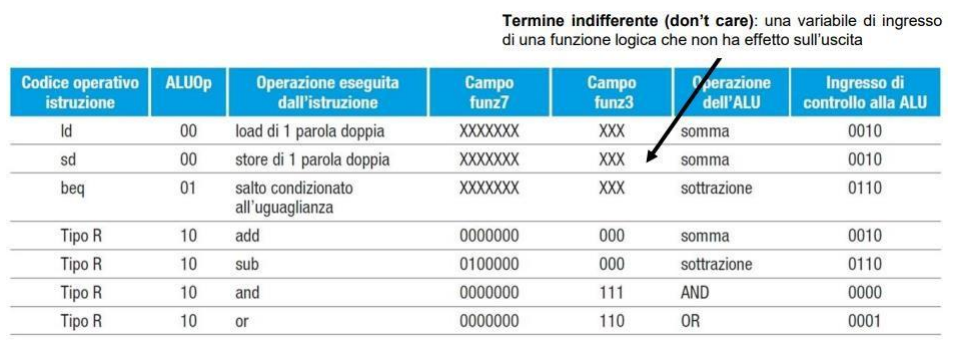

In base al tipo di operazione, la CU passa all'alu 4 bit di indirizzamento per l'operazione da eseguire (baso di sd/ld o beq). Nel caso del tipo R deve anche vedere func3 e 7, per capire l'effettiva operazione.
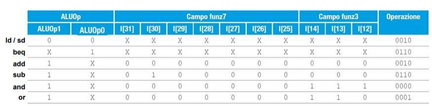

### Segnali di controllo
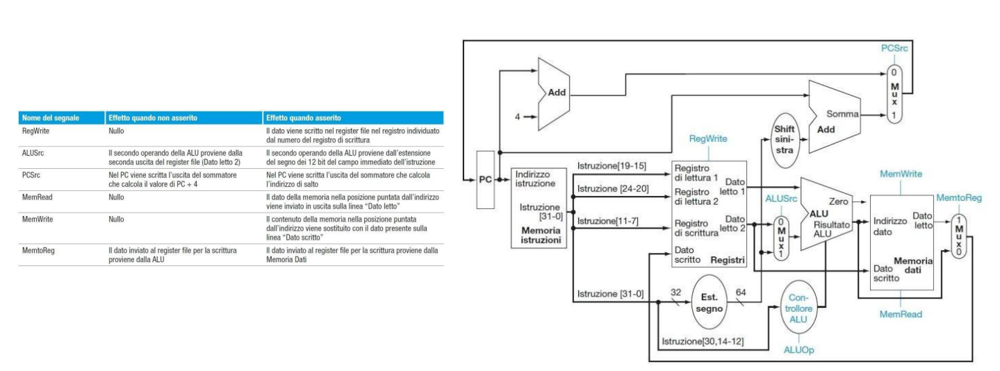
per una esecuzione completa di un'operazione, guardare le slide

# Pipeline di esecuzione

## Esecuzione multiciclo

Si introduce il concetto di istruzione come macchina a stati che ritorna per ogni stato un **Tempo di Stato**.

### Instruction level parallelism

L’insieme delle soluzioni architetturali per sfruttare il parallelismo sia temporale che spaziale nell'esecuzione di sequenza di istruzioni all'interno di una singola CPU (core)

Si cerca di ridurre il CPI mantenendo il parallelismo, quindi sovrapporre nel tempo operazioni su blocchi funzionali diversi.

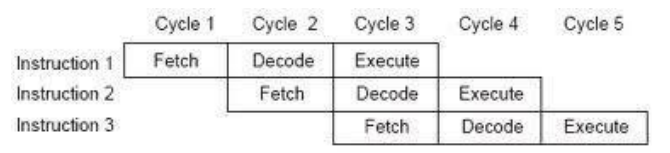

Un'esempio era il 8086 che usava il prefetch quando non effettuava operazioni.

## RISC V Pipelining

• **IF** (Instruction Fetch): Lettura dell'istruzione da memoria 
• **ID** (Instruction Decode): Decodifica istruzione e lettura operandi da registri 
• **EX** (Execution): Esecuzione dell'istruzione 
• **MEM** (Memory): Attivazione della memoria (solo per certe istruzioni) 
• **WB** (Write Back): Scrittura del risultato nel registro opportuno


L'execution è divisa in ex, mem e wb. Se un'istruzione non usa tutte le fasi va in **idle**.

Ci sono 5 stadi e quindi 5 set di registri che mantengono le informazioni (ad esempio l’IR deve mantenere 5 istruzioni

Esistono **registri di pipelining** per ritardare i segnali in modo da essere usati negli stadi successivi. Durante ID si ha il prefetch della istruzione successiva (per tenere la pipeline piena)

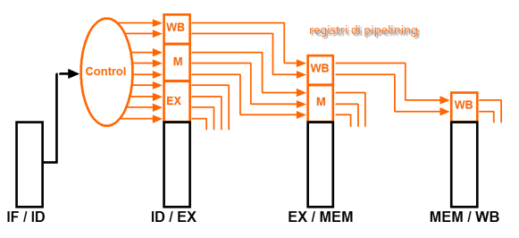

Anche i segnali che escono dall’unità di controllo devono essere posti in registri perché dovranno essere eseguiti subito i comandi che si riferiscono alla fase EX, poi quelli della fase MEM (se esistono) poi quelli della fase Writeback.

Per gli **esempi** guardare slide.

### Condizioni di funzionamento

1) la sovrapposizione di operazioni **non crea conflitti di risorse**
2) tutte le operazioni hanno la **stessa velocità** (carico bilanciato)
3) ogni stadio prevede **REGISTRI come memorie a doppia porta** che memorizzano il data path e le istruzioni con i relativi segnali di controllo tra ogni stadio ed il successivo (rw e rd contemporanee)

### Prestazioni

Il pipelining **aumenta il throughput** ma alza le latenze (una singola istruzione richiede più tempo)

Lo **speedup** è descritto dalla seguente formula
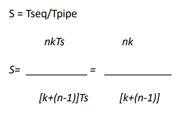
per n (numero istruzioni) che tende a infinito esso tenderà a K (il numero di stadi).

Importante considerare anche gli **stalli** (dovuti a pause per ritardi o clear della memoria):
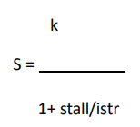
Quindi lo speedup effettivo è **k diviso la percentuale di stallo per istruzione**.

## Alee di Pipelining

### Strutturali
Si presenta quando si deve accedere a una **risorsa condivisa in più stadi della pipeline** (esempio: memoria durante fetch ed execute)
Le soluzioni sono riprogettare l'hardware (consigliato, ma costoso) o inserire ulteriori stalli che causano notevoli **speedown**.

### Di dato
Si verifica quando i dati richiesti da un'istruzione (prodotti da una precedente) non sono disponibili. Sono effettivamente delle **dipendenze** tra istruzioni. Il problema può essere parzialmente mitigato dai compilatori evitando di avere istruzioni con dipendenze vicine.

#### RAW
**Read After Write** (Lettura dopo Scrittura). L'istruzione j prova a leggere un dato prima che l'istruzione i lo abbia scritto. Sono chiamate "*true dependency*" perché non si possono evitare.
#### WAR
**Write After Read** (Scrittura dopo Lettura). L'istruzione j modifica un dato prima che l'istruzione i lo abbia letto (quindi avviene una lettura errata). Sono chiamate "*anti-dipendenze*", perché i compilatori generalmente usano più registri del necessario per evitarle.
Si presenta solo se è possibile scrivere in registri in più stadi e se le pipeline sono di velocità diversa.
#### WAW
**Write After Write** (Scrittura dopo Scrittura). L'istruzione j tenta di scrivere un dato prima che venga scritto dall'istruzione i. Se i ha come destinazione la sorgente di j e viene finita prima.
Anche questa è una anti-dipendenza e avviene solo se si scrive sullo stesso registro con più pipeline.

### Di controllo
Si ha una alea di controllo se si verifica un **cambio nel controllo di flusso** (jump, call, ciclo etc) e l’istruzione che deve essere eseguita non è più quella che segue l’istruzione precedente e che era stata caricata sulla pipeline; la pipeline si deve svuotare e si devono inserire bolle nella pipeline.
### Soluzioni

#### Stalling
Semplicemente rallentare l'esecuzione inserendo stalli. Si verificano forti speedown.
Generalmente usate per risolvere RAW.
#### Forwarding
E' una soluzione hardware costruita tramite registri intermedi (bypass) e multiplexer prima di salvare il risultato nel registro effettivo.Si usa solo per le RAW.
E' comunque necessario l'utilizzo di stalli ma in maniera minore, specialmente se il compilatore modifica l'ordine delle istruzioni in maniera intelligente.

#### Renaming
Soluzione Hardware per WAW e WAR. Rinomina i registri durante la pipeline, in modo da non avere sovrapposizioni di anti-dipendenze.
Solitamente è possibile perché molte architetture hanno a disposizione molti più registri di quelli nominali ad uso del compilatore.

#### Soluzioni per alee di controllo
- **Stallo**: aspetto fino al risultato dell'istruzione di salto
- **Always not taken**: si considera che non ci siano mai salti: molto oneroso a livello temporale (devo pulire spesso la pipeline)
- **Forwarding**: riduco gli stalli tramite il forwarding
- **Branch prediction**
##### Branch prediction statica
Sono fatte a compile time: statisticamente le miss-prediction vanno dal 5 al 22%.
A meno che non ci siano indicazioni nel codice, si deve fare una scelta:
- **Predict never taken**: continuo dopo il salto
- **Predict always taken**: popolo la pipeline con le istruzioni puntate dal salto
- **Predict by Op Code**: scelgo se saltare o no in base all'opcode

Esistono statistiche per cercare di ottimizzare la scelta, generalmente la always taken è migliore se aiutata dal compilatore a ridurre gli stalli.
Nel caso *never taken*, se sbagliamo la predizione abbiamo 3 stalli obbligatori: 
- scarto istruzioni
- pulitura stadi IF,ED,EX
- ricarica della pipeline

##### Branch prediction dinamica
Si usano tabelle che fanno predizioni in base alla storia delle operazioni precedenti

###### Branch Prediction Buffer
Viene definito un buffer, una piccola cache fully associative e LRU (last recently used) che mantiene gli ultimi n branch eseguiti dalla CPU.
Il BPB viene usato in **fase di decode** prima ancora della esecuzione; permette quindi di risparmiare almeno uno stadio (ma si perde il tempo della decodifica).

###### Branch Target Buffer
Con una piccola memoria cache che può essere direct mapped o fully associative e LRU che viene letta nella fase di fetch assieme alla istruzione.
Si mantiene l’indirizzo della istruzione che può creare un salto, la predizione ma in più anche l’indirizzo a cui si deve saltare se il salto deve essere preso.
La percentuale di miss-prediction è molto bassa (per 4000 linee è 1-15%)
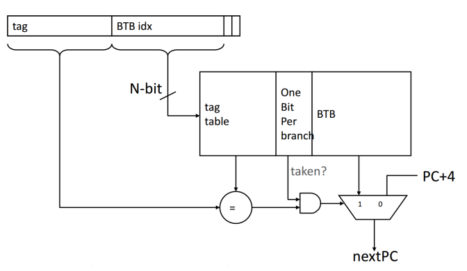


# Architettura delle Memorie
## Architettura standard

### BUS RDY # signal
Molte volte la memoria non riesce a rispondere in tempo alla richiesta di un dato (la CPU è molto più veloce).
C'è un segnale BUS RDY # (bus ready) di controllo che dice alla CPU di aspettare la risposta della memoria (esempio: la memoria ha bisogno di 6 cicli di clock per rispondere).
Il segnal BUS RDY (Wait nell'immagine) viene controllato dalla rete logica della CU, che sa quanto è veloce la RAM.

## Tipi di memoria
- centrale
- di massa
#### Classificazione
- Capacità
- caratteristiche fisiche
- modalità di accesso
- Organizzazione
- Prestazioni

##### Capacità
**CxM**, dove M è il numero di parole, N la dimensione delle parole. Solitamente N=8 (byte-wide)
Spesso la word è maggiore a causa dei bit di ridondanza.
Esistono codici di rilevazione di errori: bit di parità, oppure di correzione tramite il codice di Hamming. Per questo sono necessari bit aggiuntivi alla parola.
##### Caratteristiche fisiche
- magnetiche
- semiconduttori
- ottiche
- ...
Ma anche _affidabilità_ (MTBF, mean time between failure)
_Alterabilità_, cioè se può essere scritta o no (es ROM)
Durevolezza o _volatilità_, indicano il tempo definito o indefinito di permanenza in memoria (es la RAM è volabile perchè si perde al mancare dell'alimentazione)

##### Modalità di accesso
- sequenziale
	per accedere a un dato **devo** leggere tutti i precedenti
	esempio: nastro
- diretto
	indirizzo una cella e non passo dalle precedenti
	Tacc = Treq + Tstartup + N * Tdato
	esempio: hard disk
- casuale
	Il tempo di accesso è costante
	Solitamente a un indirizzo corrisponde un dato 1:1
	Tacc = Tadd + Tdato (Tdato è il ritardo della memoria)
	esempio: RAM
- associativo
	Controllo nella zona degli indirizzi e da lì passo ai dati, se lo trovo.
	C'è un' associazione tra indirizzo della cpu e zona degli indirizzi. Se non c'è, il dato manca. Sono memorie veloci ma piccolissime. Solitamente usate per i dati frequenti.
	Esempio: Cache
	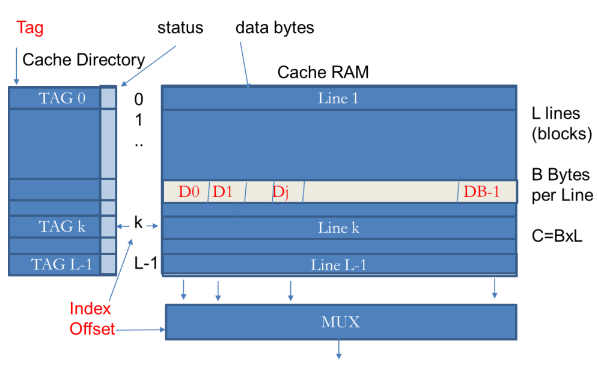
	L'indirizzo che esce dalla CPU contiene il TAG (primi Nadd-log2(B)) e l'OFFSET (log2(B)).
	La prima parte va a cercare nella cache dir, l'offset va a pescare il dato nella linea corrispondente. (ricorda che c'è una corrispondenza per linea tra cache dir e cache data).
	Ci sono due bit di stato: H/M (Hit or miss, un comparatore con un or e il bit valido della cache) e dirty: quest'ultimo indica se si sta leggendo o scrivendo, per capire se bisogna fare una copia aggiuntiva in memoria centrale (in scrittura).
	Inoltre c'è un bit status (nell'immagine) per capire se è valido o no (esempio: inizialmente tutto è a 0 e non è valido)
	Quando devo scrivere in cache, se è vuota, vado nel primo libero (Miss). Se devo sovrascrivere uso LRU (complicata in HW, elimina il più vecchio) oppure Random.
	E' usata solo nelle cache molto piccole a causa del costo hardware.

#### Memorie non gerarchiche
Classico accesso in serie

#### Memorie gerarchiche
From fast to slow (generalmente proporzionali alla distanza dalla CPU)

La Cache finisce in mezzo: fa da intermediario tra memoria di massa e la CPU.
La cache viene popolata seguendo l'algoritmo LastRecentlyUsed, cioè mantengo i dati più recenti sovrascrivendo quelli di utilizzo meno recente.
Uno dei modelli usati è il **WriteBack**, dove salvo alcuni dati sulla cache. Il lato negativo è che bisogna occuparsi della scrittura sulla memoria centrale quando la cache viene cancellata o rimpiazzata. (Ci saranno discrepanze tra cache e memoria centrale in alcuni momenti).
Un altro è il **WriteThrough**, è più lento ma consente la consistenza di tutte le memoria (scrivo in tutta la gerarchia).
## Principio di località
- **Temporale**: accedendo ad un dato è assai probabile che si debba accedere nuovamente ad esso in un breve intervallo di tempo ossia in un tempo “localmente vicino”
- **Spaziale**: accedendo ad un dato è assai probabile che si debba accedere ad un dato allocato in uno spazio in memoria localmente vicino.
	Esempio: copio tutta una linea di word al posto di una sola. Questo accelera il processo nel caso io usi questi dati vicini, ma è dannoso in caso contrario (pollution).
	Questo è effettuato in Hardware.
**Località nel codice**: 
Il codice non vede la gerarchia: _considera tutto come memoria centrale_.
Subentra il concetto di **memoria virtuale**: la memoria di massa è usata come cache / centrale.
Questo viene descritto come **paginazione**. Il sistema operativo decide quali blocchi vengono spostati in base alle operazioni richieste dal software.
Le vecchie gerarchie avevano registri, cache L1 e MMU internamente alla CPU.
Cache L2 e memoria centrale erano esterno.
Ora, coi sistemi multi core, le cache sono distribuite con la L3 condivisa.

## Tipi di cache associative

**Ottime immagini che descrivono l'accesso in memoria sono nel pdf "memorie 1" su moodle**. Non le ho inserite per tenere un po' più pulito qui.

- **Fully associative**
	● È la cache descritta precedentemente con piazzamento completamente associativo ossia senza vincoli sull’indice in cui la linea può essere piazzata 
	● È quella con maggiore grado di libertà, in quanto la linea che viene scritta a partire dal livello di gerarchia più basso può essere piazzata in una qualsiasi linea presente. 
	● L’indirizzo è quindi composto da: ○ una parte di offset di NB=log2B bit (dove B è la dimensione del blocco) ○ una parte di tag da NT= na-log2B bit, che vengono usati per essere associati a tutte le linee della cache. 
	● Questa architettura è la più efficiente, ha mediamente la miss rate più bassa ma è anche la più costosa per il costo della logica di controllo dei tag. 
	● È inoltre la più costosa anche per decidere la politica di rimpiazzamento nel caso di cache piena.
    
- **N-way associative**
	● È la cache più usata, ed è un compromesso tra le architetture precedenti. 
	● Le linee della cache sono divise in S set da n vie ognuna (n-way associative). 
	● Ogni linea del livello inferiore della gerarchia può essere piazzata in un solo set ma in una qualsiasi delle n linee dentro al set. 
	● È una cache quindi direct mapped a livello di set ma totalmente associativa dentro al set; perciò il miss rate è minore rispetto al caso precedente perchè ci sono più possibilità di mantenere la linea nella cache senza doverla rimpiazzare. 
	● L’indirizzo è composto da: ○ una parte di offset di NB=log2B bit ( B dimensione del blocco) ○ una parte di index di Ni= log2S (con S=L/n il numero di set) ○ da NT= na-Ni-NB bit di Tag che vengono usati per essere associati al tag memorizzato all’interno.
	
- **Direct mapped**
	La cache direct mapped prevede una sola possibilità di piazzamento per ogni linea. In questo senso è l’estremo opposto della fully associative
	● Ogni linea infatti usa una parte del tag come chiave unica di indice. Ogni linea se è presente sulla cache può risiedere in una sola posizione data dalla parte di indirizzo chiamata index e quindi la associazione del tag avviene con un confronto 1:1 e non 1:L come nel caso precedente. 
	● La parte di index è la parte meno significativa del tag. In questo modo due blocchi adiacenti vengono mappati in due linee consecutive e non si sovrappongono. 
	● L’indirizzo è quindi composto da: ○ una parte di offset di NB=log2B bit (B dimensione del blocco) ○ una parte di index di Ni= log2L (con L il numero di linee) ○ e da NT= na-Ni-NB bit di Tag che vengono usati per essere associati al tag memorizzato all’interno. 
	● È la cache potenzialmente con il più alto miss rate ma è anche la meno costosa. ● Di fatto l’index fa da indirizzo per indirizzare solo quella linea sia della cache directory che della cache ram che può contenere il dato.

## Tipi di Miss

### Compulsory
esse si verificano quando la linea richiesta non è mai stata in cache. 
### Conflict
se sono dovute a un conflitto dovute alla limitata associatività: il dato viene richiesto nella cache, sarebbe stato presente ma è stato rimpiazzato perché unìaltra linea con lo stesso index è stata richiesta in seguito e a causa della limitata associatività ha preso il suo posto. 
### Capacity
se sono dovute alla limitata capacità della cache: la linea sarebbe stata presente ma essendo la cache di capacità limitata essa è stata rimpiazzata da un’altra.
## Prestazioni
Blocco: unità di informazione minima scambiata fra livelli (es: 32 bytes) 
**Hit**: un accesso alla memoria che trova l'informazione cercata nel livello superiore. 
**Hit Rate**: frequenza di accessi trovati nel livello superiore (h). 
**Miss Rate**: (1 - h). 
**Hit Time**: tempo di accesso al livello superiore Th. 
**Miss Penalty**: tempo per rimpiazzare un blocco nel livello superiore più il tempo per fornirlo alla CPU. 
Il "miss penalty“ (Tmp) può anche essere scomposto nei tempi per reperire il primo dato di un blocco più il tempo per trasferire gli altri. 
Comprende certamente un Th e un “overhead” nel caso di miss (Tmiss). 
Tacc = h Th + (1-h)Tmp 
**Tacc** = Th + (1-h)Tmiss 
Questo perche’ Tacc= hTh+(1-h)(Th+tmiss) = hTh+Th –hTh+(1-h)Tmiss

Occhio ad avere pagine troppo ampie: si palesa il fenomeno del **pollution**, e il missrate ricomincia ad aumentare

Oggi si usa la **Split cache**, una per i dati e una per le istruzioni.

## Cache multi livello

È una gerarchia di memorie cache (L1, L2, L3) usata dalla CPU per velocizzare l'accesso ai dati.

* **L1:** Piccolissima e velocissima, integrata nel core.
* **L2:** Più grande e più lenta della L1.
* **L3:** Ancora più grande, più lenta della L2, ma molto più veloce della RAM.

La CPU cerca i dati prima in L1, poi L2, poi L3 e solo infine nella RAM.
### Politiche di Scrittura
Gestiscono come i dati modificati vengono aggiornati dalla cache alla RAM.
#### Write-Through (Scrittura Diretta)
* **Come funziona:** Ogni scrittura della CPU aggiorna **contemporaneamente** sia la cache che la RAM.
* **Vantaggio:** La RAM è sempre aggiornata (consistente).
* **Svantaggio:** Lento, perché ogni scrittura attende la velocità della RAM.
#### Write-Back (Scrittura Differita)
* **Come funziona:** La scrittura avviene **solo sulla cache**. Il blocco di cache modificato viene segnato come "sporco" (dirty bit).
* La copia nella RAM avviene solo **dopo**, quando quel blocco "sporco" deve essere rimosso dalla cache.
* **Vantaggio:** Molto veloce, le scritture avvengono alla velocità della cache.
* **Svantaggio:** Più complesso e la RAM non è immediatamente aggiornata. (incoerenza)

## Coerenza delle cache
### MESI (snoopy bus)
Unico punto di serializzazione e ogni core osserva gli altri: se c'è un errore viene invalidato il dato nelle cache.

Ci sono 4 stati:
- **Modified**: avvenuta modifica della cache
- **Exclusive**: specifica la concordanza con una cache di livello inferire (nel verso della memoria centrale)
- **Shared**: la linea è condivisa ma mai modificata; essenziale nel caso di processi multipli
- **Invalid**: linea non valida

Modified e Exclusive sono **single owner**, solo un core può modificare. Passare a shared è un *downgrade*, il contrario è un *upgrade*.

### Directry based
C'è un controllore centralizzato per gli accessi, che sono atomici.
# Memoria Virtuale

La **Memoria Virtuale** è una tecnica che permette al sistema operativo di usare il disco rigido (o SSD) come se fosse un'estensione della RAM.

Questo crea l'illusione che il sistema disponga di molta più memoria (memoria *virtuale*) di quella fisicamente installata (memoria *fisica*).

Caratteristica ancora più importante è il fatto che la memoria virtuale supporta la condivisione della memoria principale tra più processi attivi simultaneamente, in modo protetto.

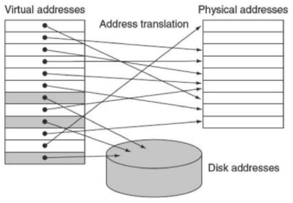

Durante l'address translation vengono anche applicati i principi di protezione.

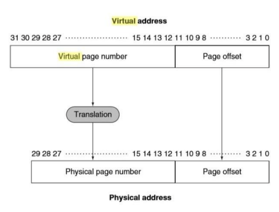

### Meccanismo di accesso
Il meccanismo della memoria virtuale vede la memoria centrale come una cache della memoria di massa
I blocchi sono le pagine La memoria centrale è fully associative
Il meccanismo di rimpiazzamento è LRU
l’accesso però non avviene in modo associativo, ma con accesso diretto tramite TRADUZIONE.
Se la pagina non c’è (miss) si ha un page fault e viene chiamato il Sistema operativo per caricare una nuova pagina dell’hard disk

### Page table
E' la tabella che contiene le traslazioni tra indirizzi virtuali e fisici. 
Nel indirizzo virtuale c'è anche un bit VALID per indicare se la pagina è presente in memoria.
L’indirizzo virtuale se non è nella PT deve essere usato per andare in memoria di massa, ed è necessario tenere traccia di dove si trova ogni pagina virtuale. 
Per questo il SO riserva uno spazio in Memoria di massa per tutte le pagine del processo in uno spazio chiamato spazio di **SWAP** deve poi avere uno spazio (separato dalla PT o unito) in cui si tiene le informazioni di dove si trovano le pagine sulla memoria fisica.

#### Tabelle multilivello
In RISC V è presente un meccanismo di indirizzamento con tabelle a più livelli: il concetto è simile alle cache n-way associative.
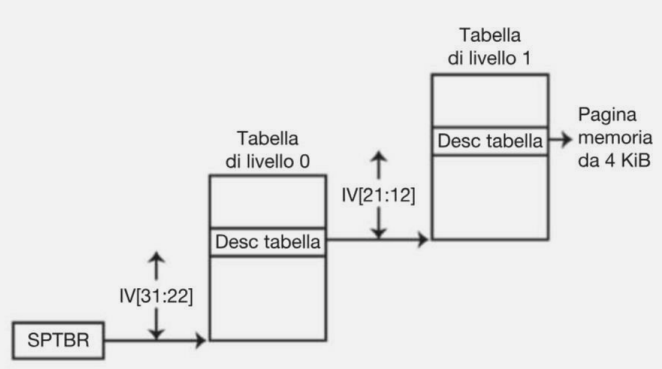

### Page Fault

2.  La MMU controlla la Page Table.
3.  Un programma cerca di accedere a un indirizzo di memoria (virtuale).
4.  **Se la pagina è in RAM:** La traduzione avviene e il programma continua.
5.  **Se la pagina NON è in RAM (ma è sul disco):** Si verifica un **Page Fault**.
6.  Il Sistema Operativo interviene:
    * Sospende il programma.
    * Cerca la pagina sul disco (nell'area di swap).
    * La carica in RAM (se la RAM è piena, "butta fuori" un'altra pagina, salvandola su disco: *swapping*).
    * Aggiorna la Page Table.
    * Fa ripartire il programma.

Il processo è estremamente lento: le pagine devono essere **grandi** e la memoria è completamente associativa per ridurre i miss. La gestione del page fault e sw per poter applicare algoritmi intelligenti e complessi per l'allocazione. La scrittura è sempre in write back, essendo la meno dispendiosa.

### Migliori performance
#### TLB
La Translation Lookaside Buffer è una piccola cache che contiene le entries della page table usate recentemente ed è direttamente nel processore (o nel memory controller).
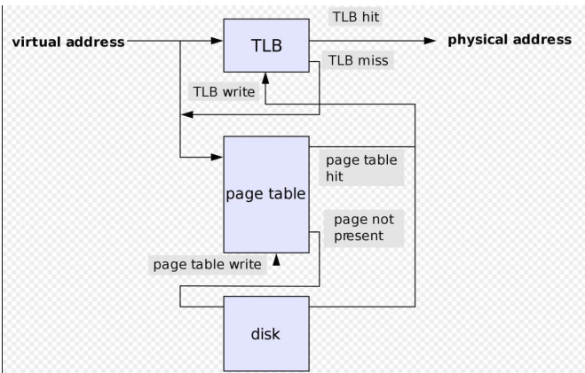

#### Come funziona
##### HIT
La pagina era in memoria: 
- si effettua la traduzione (da VPN a PPN, che sarebbe da indirizzo virtuale a fisico)
- si imposta il bit di utilizzo a 1
- se c'è una scrittura, anche il dirty bit è a 1

##### MISS
Se la pagina è presente nella memoria principale, allora la miss del TLB indica solamente che **manca la traduzione**. 
In tal caso, il processore può gestire la miss del TLB caricando dalla tabella delle pagine (dell’ultimo livello) nel TLB la traduzione dell’indirizzo virtuale, per poi ripetere l’accesso al TLB.

Se invece la pagina non si trova nella memoria principale, allora la miss del TLB indica che si è verificato un vero e proprio page fault. In questo caso, il processore richiede l’intervento del sistema operativo, sollevando un’eccezione. Dato che il TLB contiene molti meno elementi rispetto al numero di pagine della memoria principale, le miss del TLB saranno molto più frequenti dei page fault effettivi.
In caso di pagefault reale i dati vengono scritti anche nella L3 condivisa e in L2 e L1 (write through)


#### Tabella riassuntiva


#### Altre architetture
Quando si legge prima il TLB e la tabella delle pagine e poi la cache,si dice che la cache è physically indexed e physically tagged. 
In caso contrario, se prima si usa la cache allora si parla di virtually addressed cache. 
Questo è più efficiente (perchè si va prima in cache) ma potrebbe creare dei problemi di aliasing perchè la stessa pagina potrebbe avere indirizzi virtuali diversi e messa in cache a due indirizzi diversi.
Il meglio di entrambi gli approcci si raggiunge usando il **virtually indexed e physically tagged**.


# Parallelismo

Possibile tramite
- Numero di transistor enorme
- Capacità di replicazione hardware a basso costo
- Middleware e Sistemi Operativi per sfruttare l'hw

**Vantaggi**:
- **speed-up**
- **scale-up** (problema più grande ma tempo costante)
	- scalabilità **forte**: incremento di velocità, mantenendo fissa la dimensione del problema e aumentando l’hardware
	- scalabilità **debole**: ’incremento di velocità quando le dimensioni del problema 
	- crescono proporzionalmente alla crescita dell’HW

L'unità di base è il **thread**.
## HPC
High performance Computing
Si raggiunge aumentando il throughput, quindi aumentando la capacità di parallelizzare task, oppure tramite la riduzione del tempo di esecuzione. In entrambi i casi si segue la legge di Hamdal per uno speedup.

### HPC vs HTC

|**Caratteristica**|**High-Performance Computing (HPC)**|**High-Throughput Computing (HTC)**|
|---|---|---|
|**Obiettivo Principale**|**Velocità** di completamento di un singolo (o pochi) compito/i.|**Quantità** di compiti completati in un lungo periodo.|
|**Durata del Compito**|**Breve** (ore o giorni). Richiede grande potenza **subito**.|**Lunga** (mesi o anni). Richiede capacità elevata in modo **continuo**.|
|**Misura di Prestazione**|**FLOPS** (operazioni in virgola mobile al secondo).|Operazioni **al mese o all'anno** (tasso di completamento dei processi).|
|**Focus**|La **rapidità** con cui il lavoro viene completato.|Quanti **processi** possono essere completati in un lungo periodo di tempo.|

## Tipi di parallelismo

### Pipelining (temporale)
Insieme di unità utilizzate in sequenza per realizzare una computazione
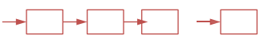
### Replicazione (spaziale)
Insieme di unità replicate e usate allo stesso tempo per singola o diverse computazioni
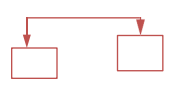

**Disponibile**: nel programma/algoritmo
**Utilizzato**: utilizzato durante l'esecuzione, il reale parallelismo.

**Funzionale**: costruisco il mio algoritmo per fare in modo che sia parallelizzabile.
**Dei dati**: strutturo i dati per fare in modo che il programma possa lavorare indipendentemente e allo stesso tempo su diverse parti di essi.

## Classificazione di Flynn

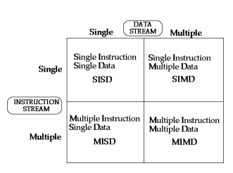
Esempio SIMD: istruzioni speciali per somme di più registri in parallelo


### SIMD
#### Vettoriali
Unità specifiche per elaborare dati vettoriali
#### Associative o Neuronali
Elaborano dati in parallelo sul modello del neurone, senza istruzioni specifiche
#### Pure
#### Sistoliche
Capaci di propagare il flusso ai processori successivi, disposti in array o forme esagonali. 
Ora poco utilizzate.


### MIDM

#### Multiprocessori (shared memory architecture)
Replicazione di processori e di moduli di memoria condivisa con un global address space. Sono anche dette Shared -memory MIMD architectures perché lo spazio di memoria è condiviso tra tutti.
Comunicano tramite variabili condivise e meccanismi di sincronizzazione.


#### Multi-computer (distributed memory architecture) 
Replicazione di PE (processing elements), come coppia processore/memoria.
**Distributed-memory MIMD architectures** perché la memoria è distribuita e privata di ogni processore.
**Message-passing MIMD architectures** perché la comunicazione avviene con scambi di messaggi
Spesso ques'ultima usa SPMD (Single Program Multiple Data), in cui di fatto i diversi processori eseguono lo stesso programma su dati diversi, ma permettendo un flusso di istruzioni diverso.


### UMA e NUMA

**Unified Memory Access**: ogni processore ha lo stesso tempo di accesso in memoria. La memoria ha relazione simmetrica con i core quindi sono anche **Symmetric Multiprocessor**.

NUMA: il tempo di accesso non è costante: dipende dalla posizione del dato.
### Multiple Issue
Questo tipo di architettura permette di far iniziare più istruzioni in contemporanea.
#### Super pipeline
In ogni stadio molte operazioni sono eseguite in porzioni del clock differenti. Più operazioni partono assieme per permettere un CPI<1.

#### VLIW
Per alcune operazioni vengono eseguite più operazioni in contemporanea. 
E' una scelta definita nell'ISA e realizzata dal compilatore.
Solitamente sono operazioni SIMD.

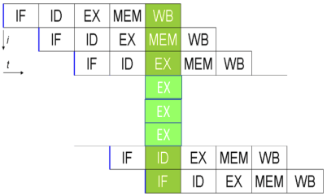
*Con un solo fetch di istruzione il compilatore esegue più istruzioni*

I core VLIW sono **Static Multiple Issue**: deciso dal compilatore staticamente. 
Il parallelismo ottenuto è l' **Issue Width**, il numero di istruzioni che possono essere compilare assieme in un'unica istruzione del linguaggio macchina.

#### Super Scalare
Architetture multi-core.  (acquisisce più istruzioni tramite il pre-fetch)
La scelta di istruzioni che vengono eseguite viene effettuata a runtime.
E' necessario avere accortezze sulla sincronizzazione per evitare alee di dati.
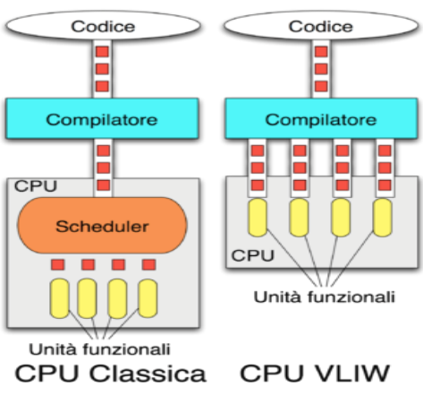
##### Esempio: Pentium 1993
Pipeline U (tutte le istruzioni, compreso il *microcodice*), e Pipeline V (solo istruzioni semplici).
La scelta della pipeline avviene durante il decode (runtime). La superscalarità è di 2.
Durante il write-back si sincronizzavano sui registri (che sono costruiti per supportare doppie scritture contemporanee).

*microcodice* = istruzioni complesse tradotte in RISC per ridurre l'hw.

#### Esecuzione speculativa
Alcuni blocchi di codice vengono pre-eseguiti per evitare gli stalli a tutti i costi, anche se potrebbero essere porzioni di istruzioni che non sono necessarie (es: una branch in cui non si entra).
Il compilatore staticamente cambia l'ordine delle istruzioni per raggiungere questo obiettivo. 
I risultati sono inseriti in *scratch registers* che vengono copiati se il blocco doveva essere effettivamente eseguito. La tabella esecutiva per tenere traccia è la *scoreboard*.
Avviene quindi un *renaming* tramite la **Register Alias Table**, per evitare la modifica dei veri registri e delle WAW e WAR. E' usata per evitare il tempo di attesa di un registro utilizzato da un'altra operazione parallela.

#### Esecuzione fuori ordine
Ogni blocco può essere eseguito in ordine diverso rispetto a compilatore/programmatore.
Due requisiti:
- in-order issue (dati prelevati in order)
- in-order commit (dati riscritti in ordine)

### Architetture nel tempo
#### Esempio: Pentium II (super scalare)
##### Front end
- Front end (fetch e decode)
- Execution Core (le istruzioni senza vincoli vanno nella reservation station, che alimenta le pipeline)
	- RAT
	- le istruzioni vanno in un reorder buffer
	- si hanno le cache "non bloccanti": le istruzioni attendono nel ROB mentre altre vengono eseguite

#### Esempio: Pentium IV
Limite a 4Ghz per problemi di consumo e calore, anche se era stato progettato per 10. 
Pipeline molto lunghe che risentivano molto di branch prediction sbagliate. 

#### Progetto Core
Con il primo processore Intel Core la frequenza si abbassa, come i consumi. 
Le prestazioni però aumentano grazie a un miglior sfruttamento del parallelismo.
##### Core 2
**Wide dynamic execution**: aumenta la superscalarità del singolo core (4 way) 
Si **accorcia la lunghezza della pipeline** (14 stadi vs 31 del Pentium IV)
**Macro Fusion**: unisce assieme più istruzioni

### Core i7
... non necessari
### Tabella riassuntiva
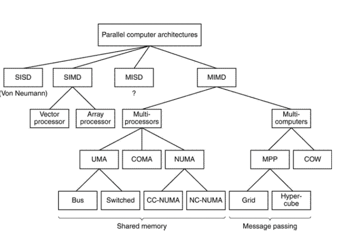

# Interruzione

Sospensione forzata del processo di esecuzione e trasferimento di controllo ad una "*routine di servizio*“ che soddisfa le richieste dell'evento che ha provocato l'interruzione, al termine della quale il controllo viene restituito al processo sospeso

*RRI* (routine di risposta all'interrupt)

**Sincrona**
- processo sistema operativo
- debugging
- page fault
**Asincrona**
- periferiche (mouse, tastiera, touchpad...)
	- di tipo hardware

### Polling

1. La CPU verifica lo stato della periferica (leggendo in locazioni di I/O corrispondenti a registri di stato) 
2. Continua la richiesta fino a che non verifica che è pronta per ricevere dati in uscita ( o fornire dati in ingresso) 
3. Inizia il trasferimento dati (in scrittura verso la periferica o in lettura) 
4. Ricomincia se necessario


### Ad interruzione
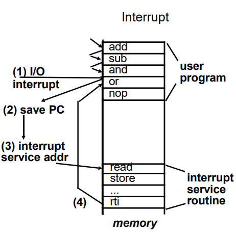
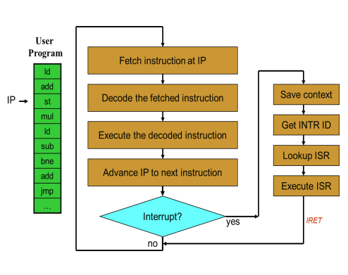
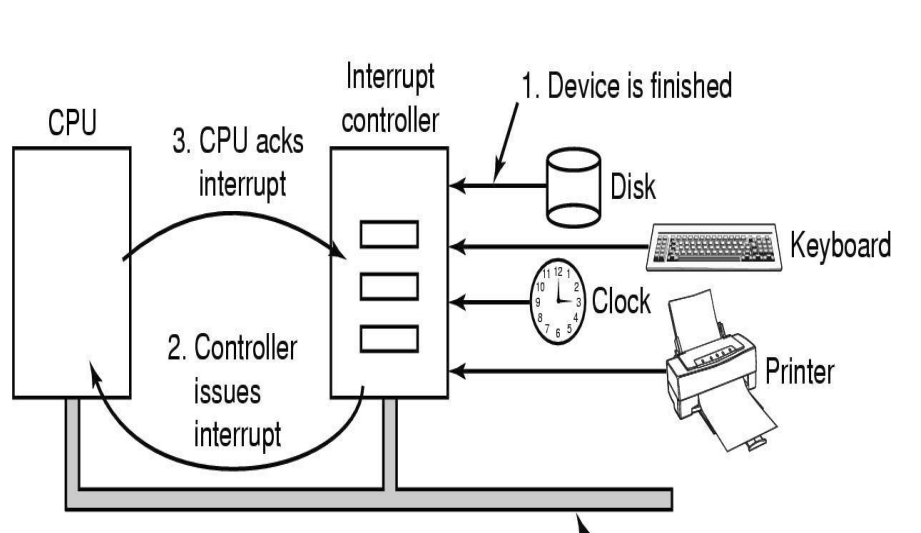

## Exceptions

### Processor-detected exception
Si verifica durante l'esecuzione del codice, sono provocate dal software indirettamente

### Programmed exceptions
Sollevate dal codice in maniera esplicita

- **Faults**: correggibile, l'istruzione si riesegue
	Scrittura in memoria senza privilegi, riscontate prima di aumentare il PC
- **Traps**: per debug, non vengono rieseguite
- **Aborts**: hardware failure
#### Esempi
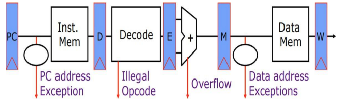


