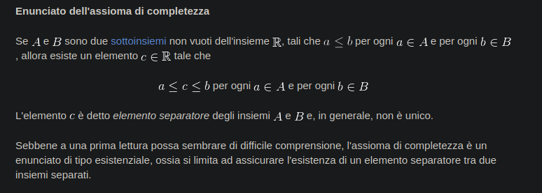
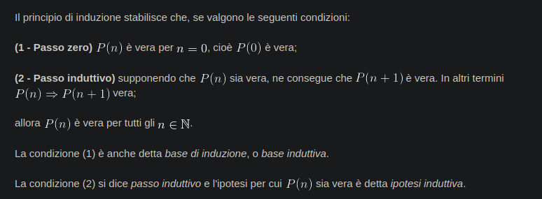
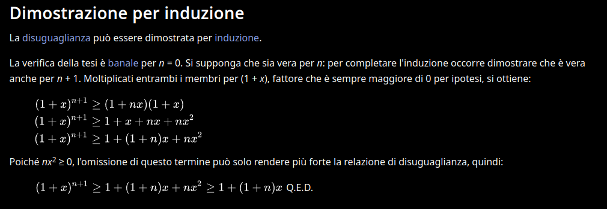
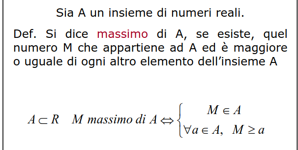
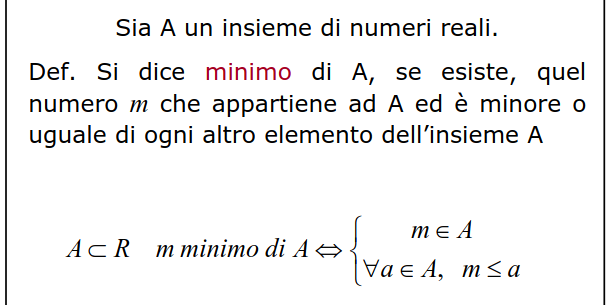
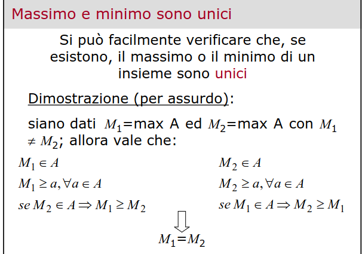
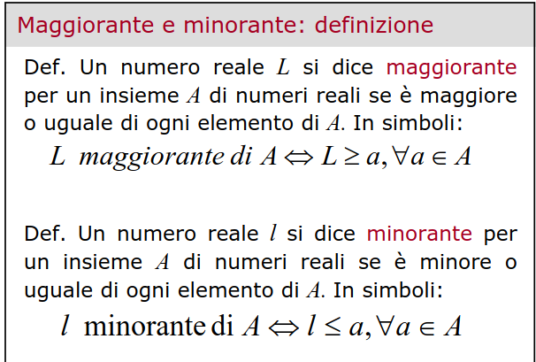
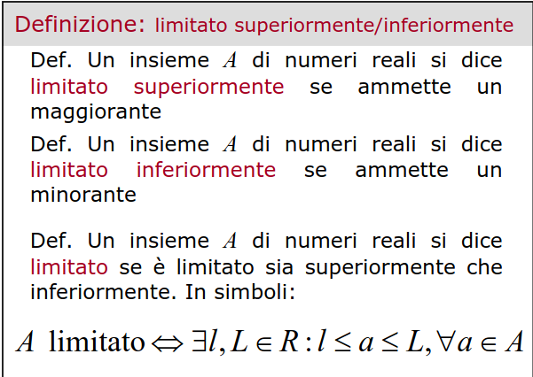
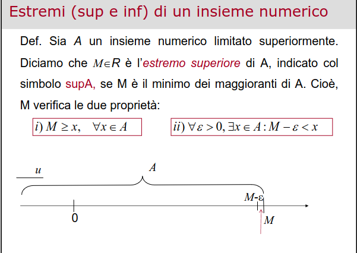
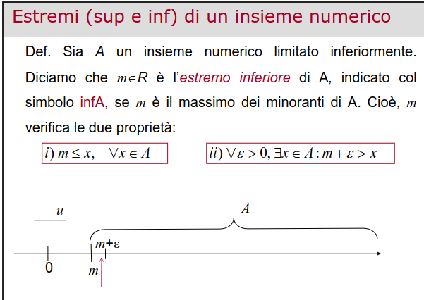

### Assioma di completezza

### Dimostrazione irrazionalità di radice di c
Per assurdo poniamo c razionale = $\frac{n}{m}$, dove n e m sono primi tra loro.
Quindi $2=c^2=\frac{m^2}{n^2}$. da questo ricaviamo $m^2 = 2n^2$, cioè che m è pari
poniamo $m=2k$ e quindi $n=4k^2/2=2k^2$. 
Anche n risulta pari, il che è assurdo, in quanto n e m dovevano essere primi tra loro.

### Disuguaglianza triangolare
$\forall (x_1,x_2), x_1,x_2 \in R$
vale $|x_1+x_2| \le |x_1|+|x_2|$
**dimostrazione:**
$|x|\le|x|$
$-|x|\le x \le |x|$
$-(|x_1|+|x_2|) \le x_1+x_2 \le |x_1|+ |x_2| \to |x_1+x_2| \le |x_1|+|x_2|$

### Principio di induzione

### Disuguaglianza di Bernoulli
**Enunciato**: $(1+x)^n \ge 1 + nx$ 

### Definizione di massimo e minimo

---

### Teorema unicità di massimo e minimo

### Definizione di maggiorante e minorante

### Insieme limitato

### Estremo superiore e inferiore

