### Definizione
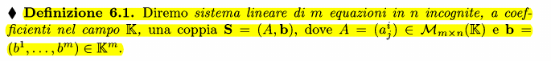

#### Matrice dei coefficienti e colonna termini noti
Nella definizione superiore, A è detta matrice incompleta mentre b (la colonna dei risultati) è detta m-pla dei termini noti

#### Matrice Completa
La matrice completa C è l'unione tra A e la colonna B:
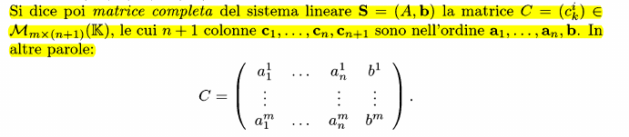

#### Esempio
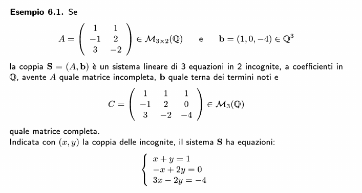

### Soluzione di un sistema lineare
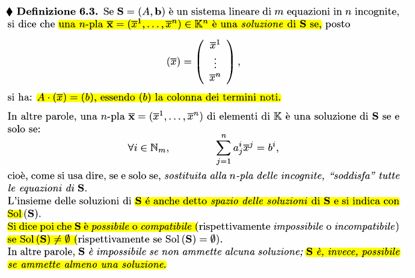

### Teorema di Rouché-Capelli
Un sistema lineare S è possibile se e solo se $\rho(A) = \rho(C)$ rango A = rango C
#### Dimostrazione

**Parte 1**
HP: $\rho(A) = \rho(C)$ (quindi che la colonna delle soluzioni sia comb. lineare delle colonne di A)
TH: il sistema è possibile
E' possibile riscrivere (b) come combinazione lineare delle colonne:
$\exists \space \lambda_1,...,\lambda_n \in \mathbb{K}: (b) = \lambda_1*(a^1)+...+\lambda_n*a^n$
quindi
$\lambda_1,...,\lambda_n \in Sol(S)$ verificata

**Parte 2**
HP: il sistema è possibile
TH: $\rho(A) = \rho(C$
per ipotesi, $\displaystyle \exists \space (\overline{x}) = (\overline{x}_1,...,\overline{x}_n) \in Sol(S) : \sum_{j=0}^n \overline{x}_j*a^j = (b)$
quindi (b) è combinazione lineare e soluzione del sistema

### Sistema omogeneo
Un sistema lineare avente la colonna delle soluzioni nulla (b) = 0
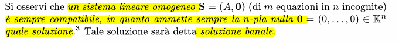

### Dimensione del sottospazio vettoriale delle soluzioni
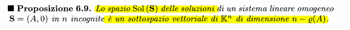

### Sistema omogeneo associato
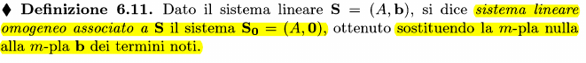
Inoltre, le soluzioni di un sistema lineare, se esistono, sono tante quante le soluzioni del sistema omogeneo associato ad esso

### Proprietà derivate dalla [[#Dimensione del sottospazio vettoriale delle soluzioni]]
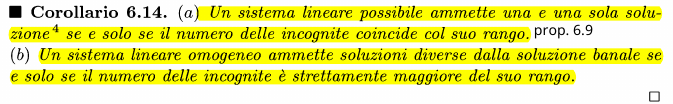

### Sistema normale (o di Cramer)
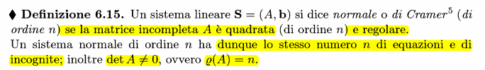

### Teorema di Cramer
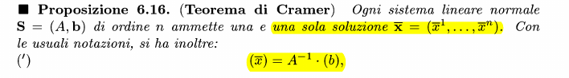

### Formula di Leibniz-Cramer
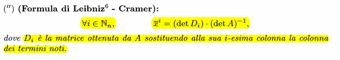

### Sistema lineare minimo
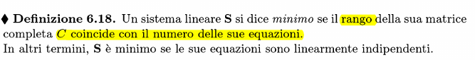

### Sistemi lineari equivalenti
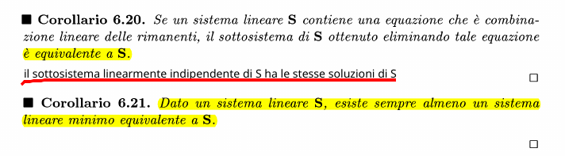