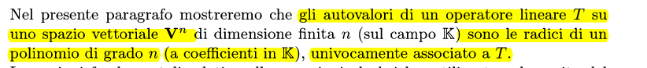
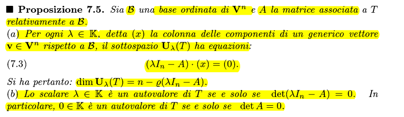
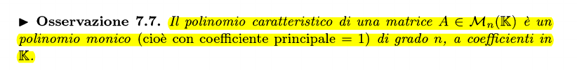
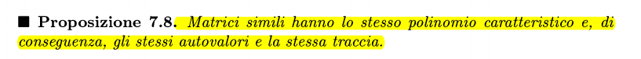
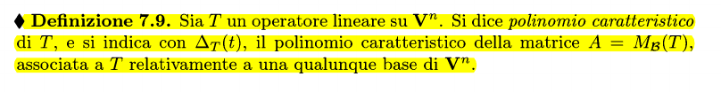
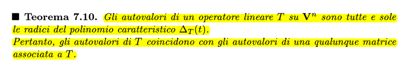
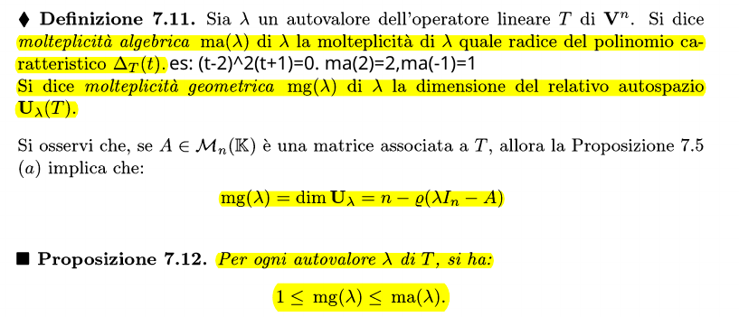

### A cosa facciamo riferimento

Radici di un polinomio -> **valori che annullano il polinomio mediante sostituzione dell'indeterminata**

### Matrice caratteristica e teorema associato

#### Dimostrazione
Sappiamo che $\forall \lambda \in \mathbb K$, $U_{\lambda}(T)=KerT(\lambda Id_n-T)$

### Polinomio caratteristico

### Proprietà matrici simili in riferimento al polinomio caratteristico

### Autovalori e polinomio caratteristico

### Molteplicità algebrica e geometrica
