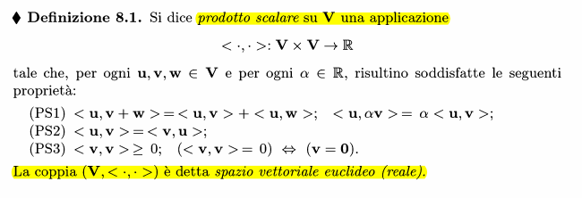
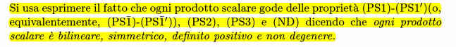
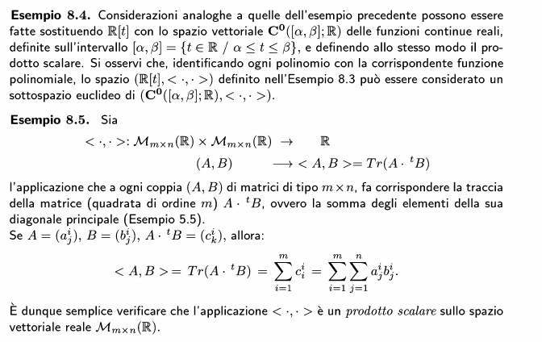
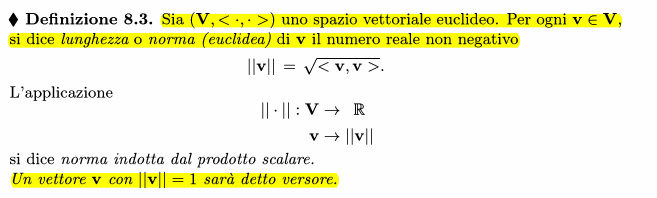
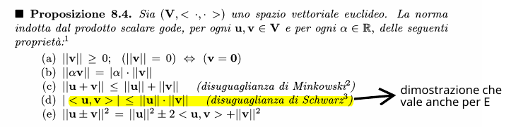
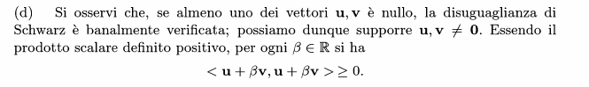
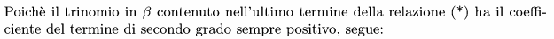
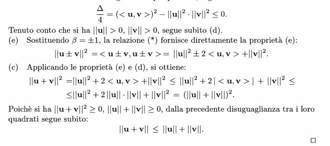
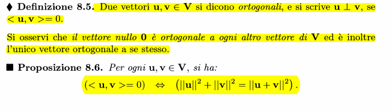
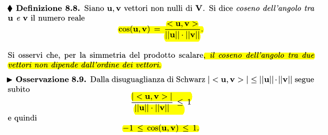

### Prodotto scalare

PS1 -> linearità rispetto alla somma, come nelle trasformazioni lineari
PS2 -> simmetrica (o bilineare)
PS3 -> solo il vettore nullo da come risultato del prodotto scalare con se stesso 0. Il prodotto scalare ha risultato reale $\ge 0$

#### Esempi

### Norma di vettore

Radice quadrata del prodotto scalare

### Proprietà della norma di vettore

#### Dimostrazione disuguaglianza di Schwarz
ricordare:

### Ortogonalità dei vettori

### Coseno tra vettori

