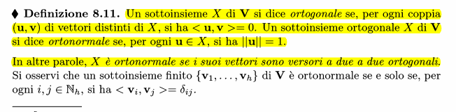
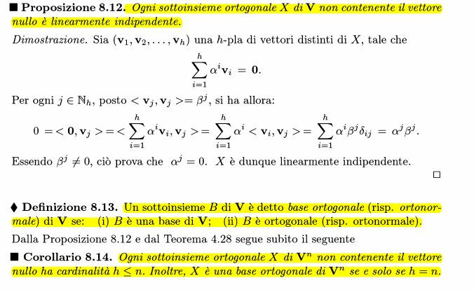
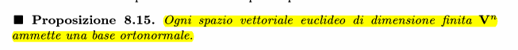
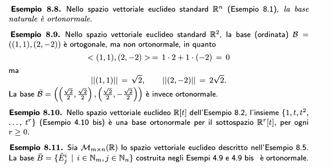
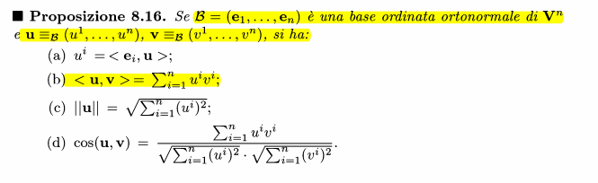
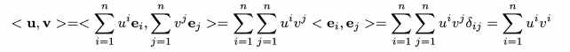
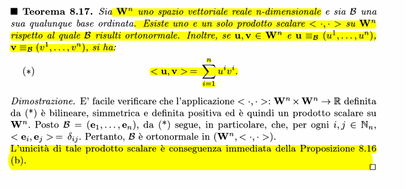
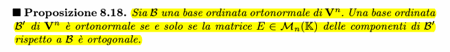

### Definizione 

### Basi ortonormali / ortogonali

#### ESEMPI

### Proprietà basi ortonormali ordinate

#### DIM B

### Unicità prodotto scalare

### Rapporto matrici cambiamento base con ortogonalità
