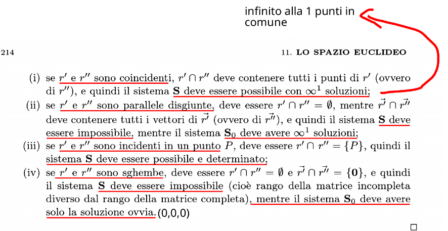
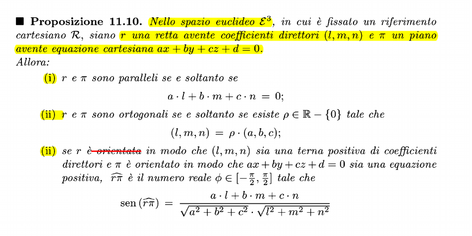
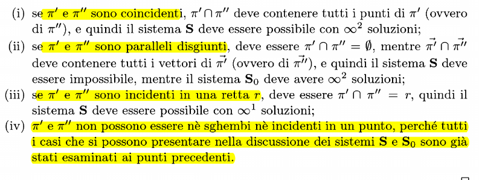
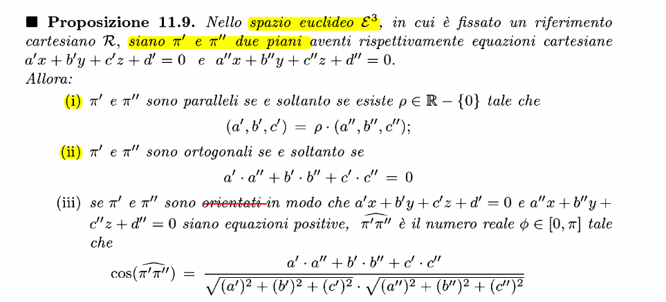
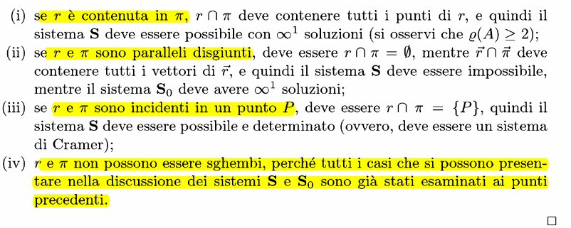

## Studio mutua posizione tra due rette

La dimostrazione è semplice: basta risolvere i sistemi A e B e vedere il numero di soluzioni che essi hanno. ATTENZIONE: nei sistemi impossibili, risolviamo i sistemi omogenei associati, che in realtà rappresentano le giaciure delle rette

### Mutue posizioni piano-piano

Dimostrazione uguale alle due rette

### Mutue posizioni retta-piano

Dimostrazione uguale alle due rette