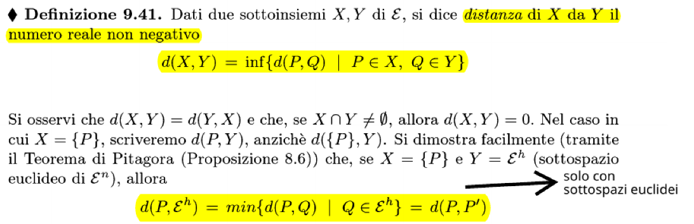
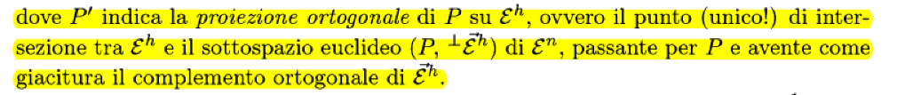
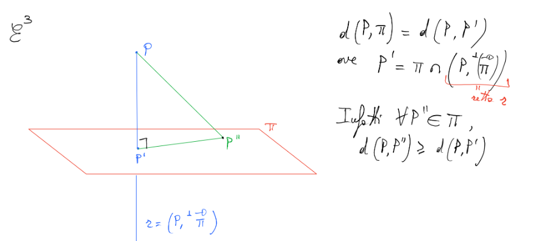
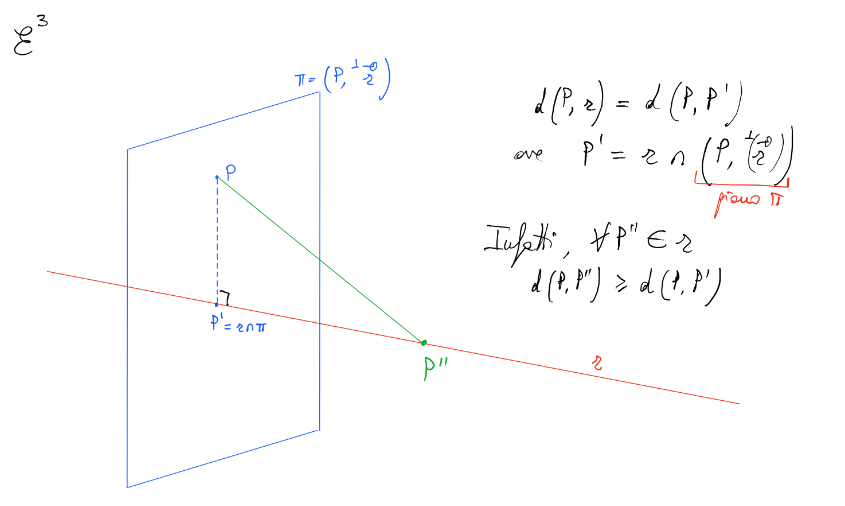
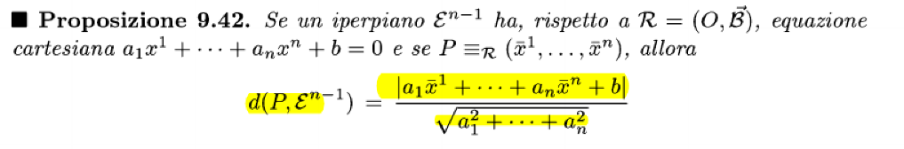
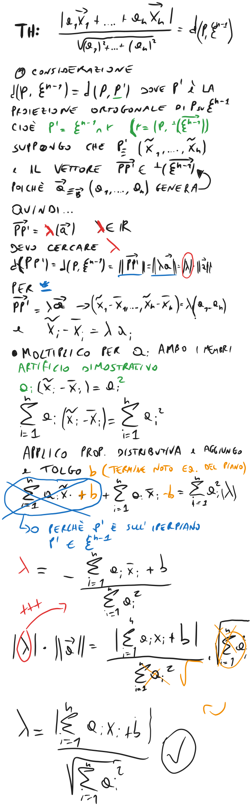

### Definizione
La distanza euclidea tra due punti P e Q è la norma del vettore libero $\overrightarrow{PQ}$
$d(P, Q) = ||\overrightarrow{PQ}||$

### Calcolo della distanza
$\displaystyle d(P, Q) = ||\overrightarrow{PQ}|| = \sqrt{\sum_{i=1}^n(x^i_Q-x^i_P)^2}$ 

### Distanza tra sottoinsiemi

#### Proiezione ortogonale

La proiezione ortogonale su un punto è una **retta**
La proiezione ortogonale su una retta è un **piano**

### Distanza iperpiano-punto

#### Dimostrazione

### Distanze tra elementi di E3
guardare da 11.16 a 11.23, no sfere

