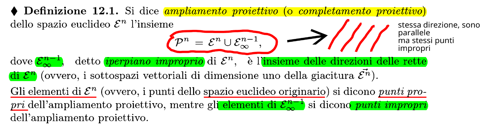
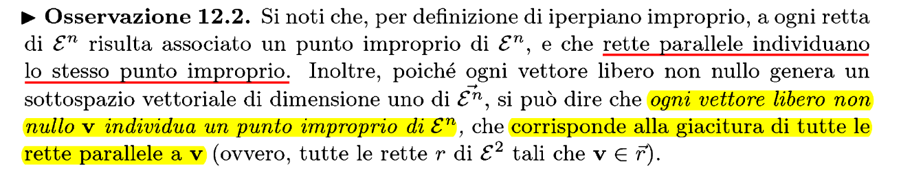
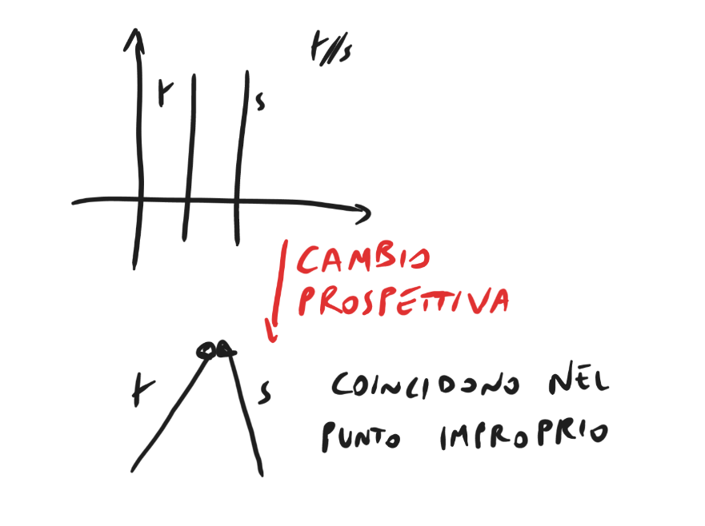
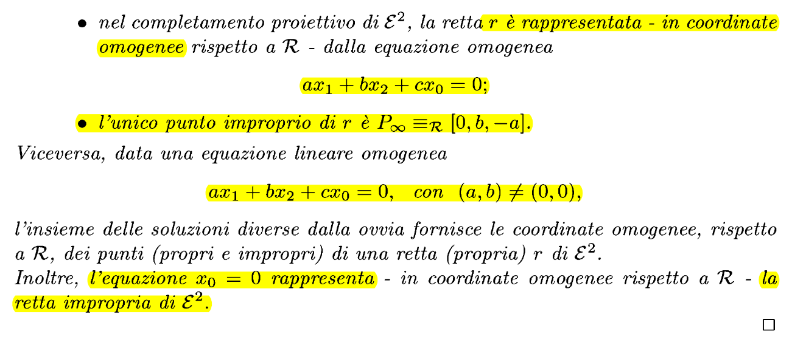
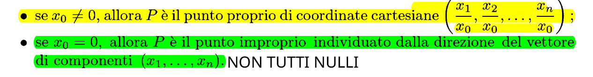

### Definizione

#### Definizione specifica per retta

In generale: sottospazi euclidei paralleli diventano incidenti nel loro completamento proiettivo. Tenere a mente la prospettiva

### Coordinate omogenee

