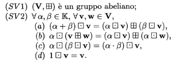
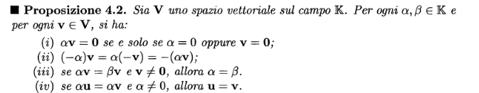
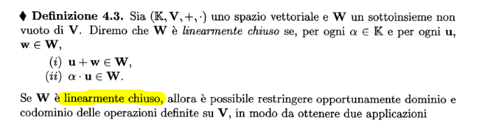
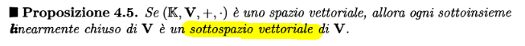
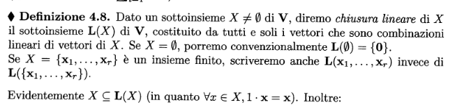
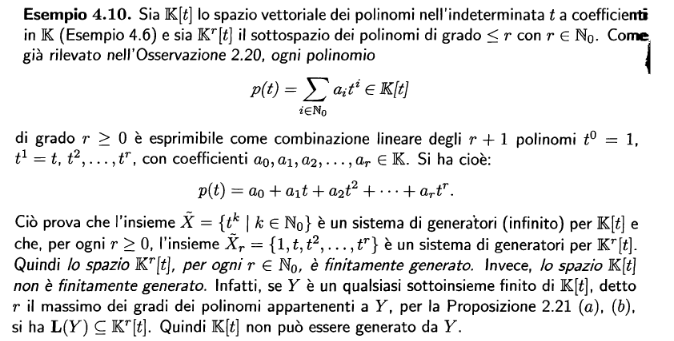

### Definizione
Sia K un campo, uno spazio vettoriale è definito come $(\mathbb K,\mathbb V, +, \cdot)$
dove + indica l'operazione di somma tra [[1. Strutture Algebriche#n-ple]] e $\cdot$ indica il prodotto tra scalare e n-pla.

### Proprietà
Affinché una struttura algebrica possa essere definita come spazio vettoriale, deve soddisfare le seguenti proprietà

## Sottospazio vettoriale

### Chiusura Lineare

### Sistemi di generatori
Uno spazio vettoriale è detto **FINITAMENTE GENERATO** se ammette un **SISTEMA FINITO** di generatori.
#### ESEMPIO
