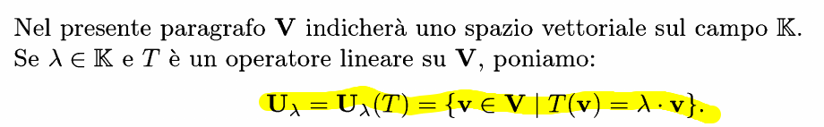
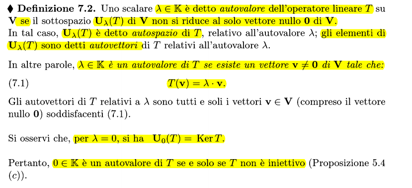
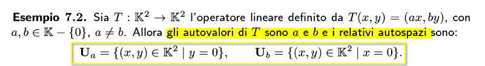
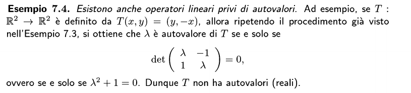

### Definizione autovalore e autovettore

#### esempio
$T: \mathbb R^2 \to \mathbb R^2$
$(x,y) \to (4x-y, 2x+y)$
$v(1,1) \to T(v) = (3,3) = 3T(v)$ per linearità della trasformazione
Quindi 3 è un __**autovalore**__ di T
v è quindi un **autovettore** dell'autovalore 3
$V_3(T)$ è un **autospazio** relativo all'autovalore 3

### Definizione autospazio

### Osservazione
E' possibile che un sottospazio non abbia autovalori:

