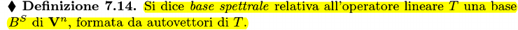
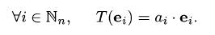
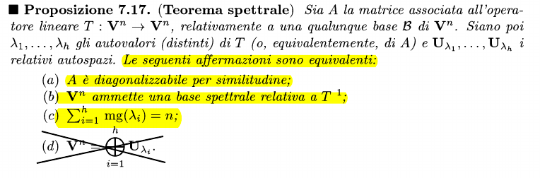
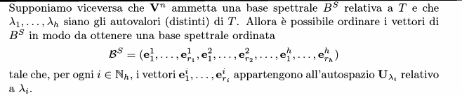

### Definizione Base Spettrale

### Associazione Matrice diagonale - base spettrale
Data una matrice $M_B(T)$ associata a T relativamente alla base B di $V^n$, se questa matrice è la matrice diagonale D=diag($a_1,a_2,...,a_n$) (dove $a_i$ è autovalore) allora B è una base spettrale di $V^n$
Visivamente:

### Matrici diagonalizzabili per similitudine
Una matrice M è diagonalizzabile per similitudine se esiste una matrice diagonale simile ad M.

### Teorema spettrale

#### Dimostrazione
Servono 2 osservazioni per poter procedere alla dimostrazione vera e propria:

**Osservazione A:**
HP: M associata di $T:V^n \to V^n$ è diagonale.
TH: B associata a M è spettrale
$M_B(T)$ = $$
\begin{flalign*}
&\begin{bmatrix}
a_1 & 0 & 0 \\
0 & a_2 & 0 \\
0 & 0 & a_n 
\end{bmatrix}
&\end{flalign*}
$$Quindi $T(e_1) = (a_1,0,...,0)$ e generalizzato $T(e_i) = (0,...,a_i,...,0)$
dove $a_i$ è autovalore e $e_i$ è autovettore della base
Quindi B = $(e_1,e_2,...,e_n)$ è spettrale

**Osservazione B:**
Contrario della osservazione A
HP: B associata a M è spettrale
TH: M associata di $T:V^n \to V^n$ è diagonale.
Sapendo che B è base ordinata e spettrale, prendiamo quella canonica con i relativi autovalori associati.
La risultante matrice è quindi: $$
\begin{flalign*}
&\begin{bmatrix}
\lambda_1 & 0 & 0 \\
0 & \lambda_i & 0 \\
0 & 0 & \lambda_n 
\end{bmatrix}
&\end{flalign*}
$$Riscrivo $\lambda_1$ o in generale  $\lambda_i$ tante volte quanti sono gli autovettori con autovalore $\lambda_i$
In altre parole

#### Dimostrazione (a) => (b)
**HP**: A=$M_B(T)$
**HP**: A è simile a una matrice D diagonale
**TH**: $\exists B^s$ Base spettrale
Per ipotesi esiste $B'^s$ di V$_n$ tale che D=$M_B'(T)$
Per L'osservazione A è verificata la tesi (B' è spettrale)

#### Dimostrazione (b) => (a)
**HP**: $\exists B^s$ Base spettrale
**HP**: A = $M_B(T)$
**TH**: A è diagonalizzabile per similitudine (A è simile a D diagonale)

Per osservazione B, A=$M_B(T)$ è diagonale.
Quindi A è simile a D perché sono associate allo stesso endomorfismo con basi diverse

#### Dimostrazione (b) => (c)
**HP:** $\exists B^s$ Base spettrale
**TH:** $\displaystyle \sum_i^h mg(\lambda_i) = n$
suddivido la Base spettrale B in modo da renderla ordinata:
$B^s = (e_1^1,...,e^1_{r_1},e_1^2,...,e^2_{r_2},)$
dove l'insieme degli autovettori $e^i$ è uno sottospazio vettoriale $U_{\lambda_i}(T)$ associato all'autovalore $\lambda_i$.
So quindi che:
$r_i \le dim(U_{\lambda_i}(T)) \le mg(\lambda_i)$
riscrivo utilizzando le sommatorie:
$\displaystyle \sum_{i=1}^h r_i \le \sum_{i=1}^h mg(\lambda_i)$
E per la proposizione 7.13 
$\displaystyle \sum_{i=1}^h mg(\lambda_i) = n$ è verificata