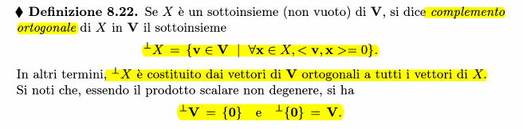
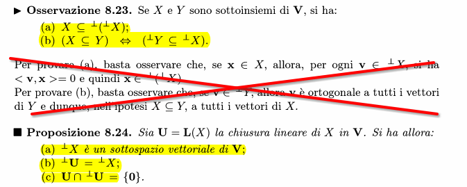
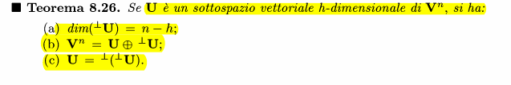
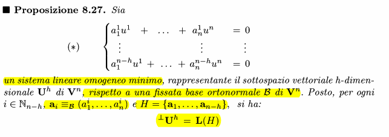
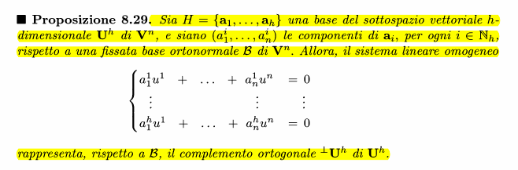
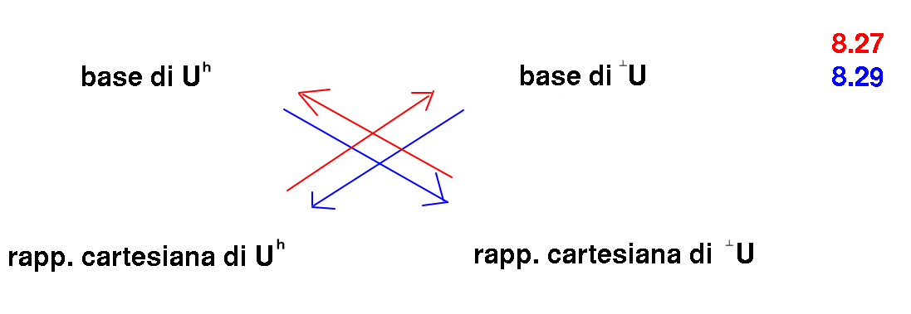

### Definizione

### Proprietà

#### DIM c)
HP: U sottospazio di V
TH: $U \cap \space ^\perp{U} = \{0\}$
Per assurdo, suppongo che esista qualcosa diverso dal vettore nullo nell'intersezione
allora considero <$v_1$,$v_2$>=0 (che sono uguali) $v_1 \in U$ e $v_2 \in ^\perp{U}$. 
Allora v deve essere per forza nullo in quanto il vettore nullo è l'unico che è ortogonale con se stesso.

### Proprietà tra sottospazio e complemento ortogonale

#### cenni alla dim a)
HP: $U^h sottosp. V^n$
TH: $dim(^\perp{U}) = n-h$
0. Ho una base di U ortonormale -> $B''= (e_1,...,e_h)$
1. Completo a una base di $V^n$ la base di U -> $(e_1,...,e_h,f_1,...,f_{n-h})$
2. Ortonormalizzo la nuova base -> $(e_1,...,e_h,f''_1,...,f''_{n-h})$
3. Si può dimostrare che questa ultima è base ortonormale di $^\perp{U}$
4. Per definizione di base, la tesi è confermata

### Rappresentazione complemento ortogonale con sistema lineare minimo

L(H) dove H è l'insieme dei vettori componenti rispetto alla base

#### Inverso

### Schema riassuntivo delle osservazioni precedenti
