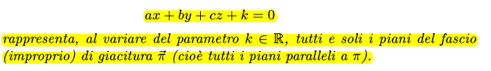

### Fasci propri
I fasci di piani proprio sono tutti i fasci che passano per una certa retta
La stessa cosa vale per le rette, ma con un punto

Quindi la retta r sarà l'unione dei due piani: $\pi' \cap \pi''$ 
### Fasci impropri
Tutti i piani (o rette) paralleli, quindi con giaciutura uguale.

