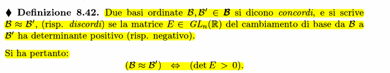
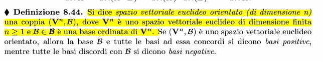
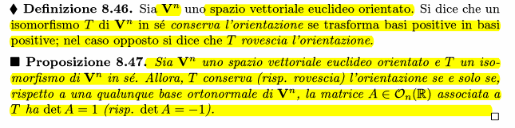

### Definizione di basi ordinate concordi/discordi

det(E) > 0 -> concordi
det(E) < 0 -> discordi

### Definizione spazio euclideo orientato

### Matrici associate e isomorfismi

Matrici con det = 1 non cambiano il segno, quelle con det = -1 invece si