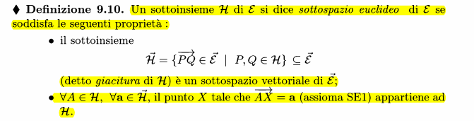
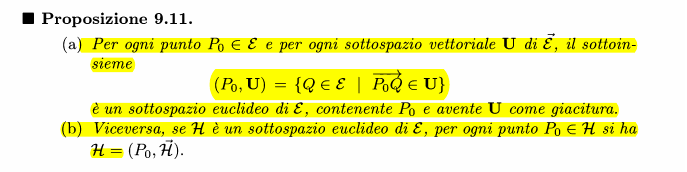

### Definizione di sottospazio euclideo e giacitura

### Unicità del sottospazio euclideo tramite la sua giacitura e da un punto

### Punti affinemente (in)dipendenti
![[Pasted image 20231121171111.png]]

### Unicità sottospazio euclideo per punti affinemente indipendenti
![[Pasted image 20231121171148.png]]

#### Dimostrazione (solo esistenza, non unicità)
Basta considerare $(P_0,(\overrightarrow{P_0P_1},...,\overrightarrow{P_0P_h}))$, che è un sottospazio euclideo di dimensione h

### Parallelismo tra spazi euclidei (mutue posizioni)
![[Pasted image 20231121171621.png]]

#### Esempi
![[Pasted image 20231121171726.png]]
![[Pasted image 20231121171739.png]]

### Unicità e parallelismo
![[Pasted image 20231121171836.png]]

