### Definizione
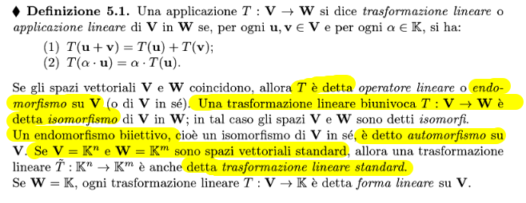
se V=W -> endomorfismo
Trasformazione lineare biunivoca -> isomorfismo
Trasformazione lineare biettiva -> automorfismo
Su spazi vettoriali standard -> trasformazione lineare standard

### Composizione
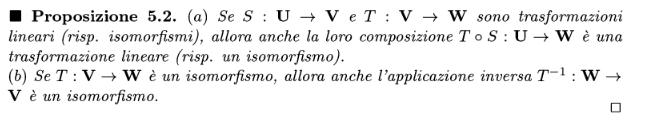

### Nucleo
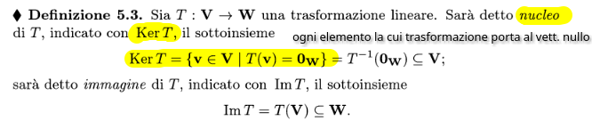

### Immagine
esattamente lo stesso concetto di immagine in una applicazione, quindi
$Im T = \{w \in W \space : \space \exists v \in V \space \space T(v)=w\}$

### Proprietà delle trasformazioni lineari
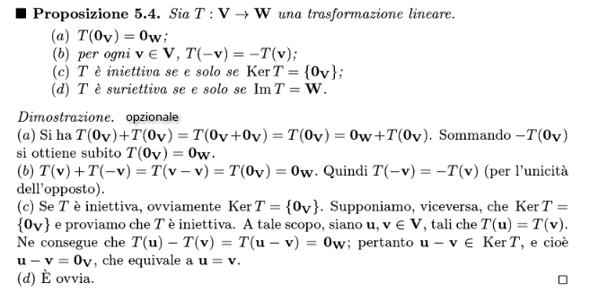

### Operazioni con sottospazi
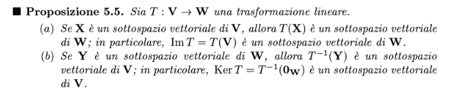

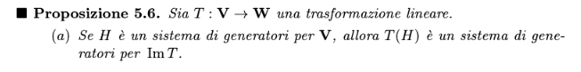
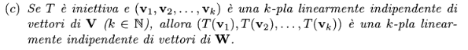

### Equazione Dimensionale
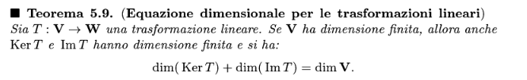
#### Dimostrazione
Poniamo n = dim(V)
In quanto KerT è sottospazio vettoriale di V, dim(KerT)=h, con h $\le$ n
Considero una base del nucleo $B_{KerT} = \{e_1,e_2,...,e_h\}$ e per il  [[Basi e dimensioni#Teorema del completamento a una base]] posso completare $B_{KerT}$ per ottenere $B_V$:
$B_v = \{e_1,e_2,...,e_h,f_1,f_2,...,f_n-h\}$ 
Per teoremi noti, applicando la trasformazione lineare a tutti i vettori di $B_v$ ottengo un sistema di generatori per $ImT$:
$\{T(e_1),T(e_2),...,T(e_h),T(f_1),T(f_2),...,T(f_n-h)\}$ -> in quanto ogni $e_i$ fa parte del nucleo, il suo trasformato è il vettore nullo, cioè $\mathbf W_0$. Il risultate sistema di generatori è:
$\{T(f_1),T(f_2),...,T(f_n-h)\}$ (guardare proposizione 5.6 per capire che è sistema di generatori per l'immagine)
Quindi bisogna dimostrare che questi $h-n$ vettori sono linearmente indipendenti per dire che questa è una base di $ImT$
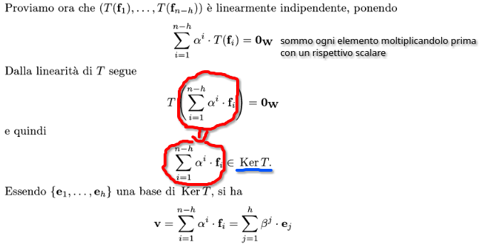
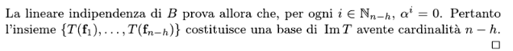
### Corollario 5.10
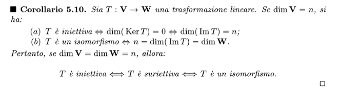

### Teorema fondamentale delle trasformazioni lineari
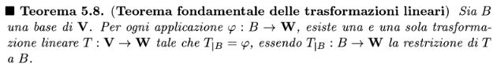
Detto con altre parole, una trasformazione lineare esiste e sai come si comporta dopo che hai studiato il suo comportamento sui vettori di una base

### Proposizioni 5.11-12-13
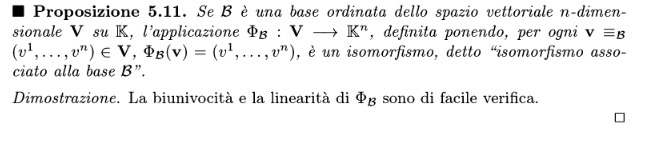
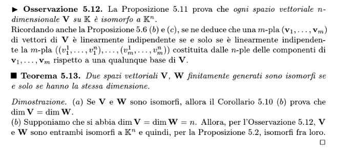

### Matrici associate a trasformazioni lineari
#### Matrici di componenti di una h-pla
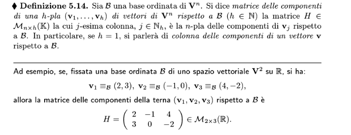

### Matrice associata a una trasformazione lineare

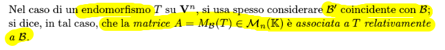
endomorfismo = dimensione uguale (Matrice nxn)
#### visualizzazione grafica
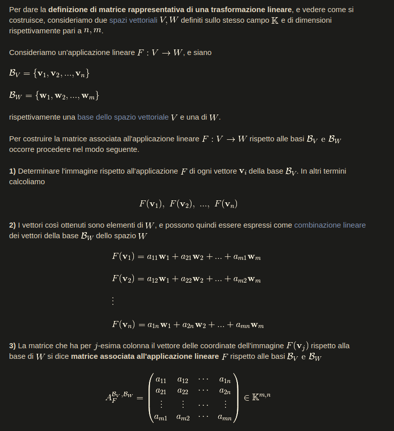
### Matrice associata ad applicazioni identiche
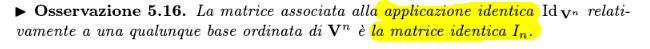

### Esempio di trasformazione da matrice associata a trasformazione lineare con base canoniche
Data la matrice$$
\begin{flalign*}
&\begin{bmatrix}
1 & 5 \\
0 & 4 \\
0 & 0
\end{bmatrix}
\text{ associata alle basi canoniche B' e B'' rispettivamente di } \mathbb{R_2} \text{e } \mathbb{R_3}
&\end{flalign*}
$$Trovare la trasformazione lineare corrispondente
Per le basi canoniche, basta guardare le righe
$$
\begin{flalign*}
&\begin{bmatrix}
\rowcolor{green}
1 & 5 \\
\rowcolor{blue}
0 & 4 \\
\rowcolor{black}
0 & 0
\end{bmatrix}
&\end{flalign*}
$$
e associare la relativa trasformazione
$T: \mathbb{R^2} \to \mathbb{R^3}$
$(a,b) \to (a+5b,4b,0)$

### Equazione Matriciale
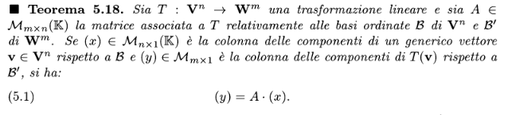

### Matrici associate a composizioni di Trasformazioni
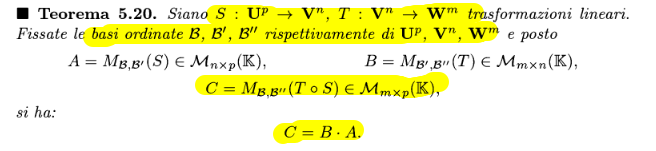

#### Casi speciali con isomorfismi (con dim)
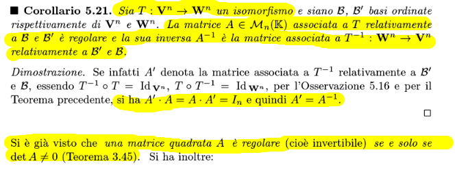

### Proprietà da applicare con i corollari precedenti
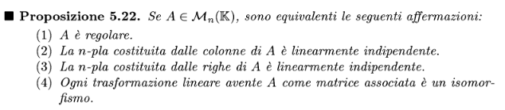
in quanto regolare:
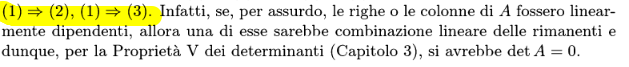
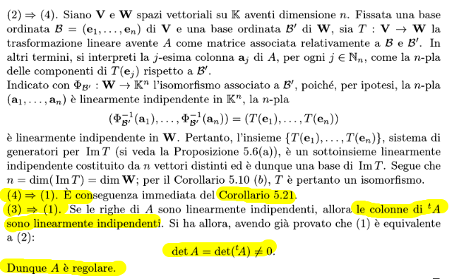
